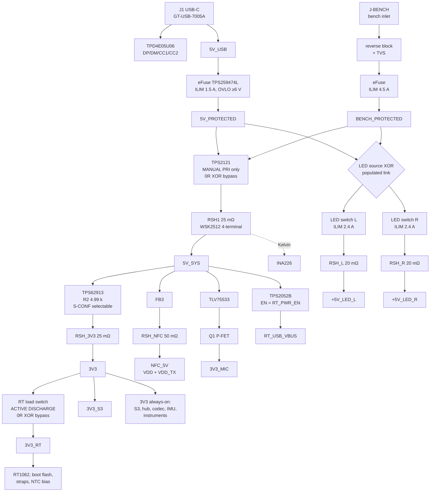
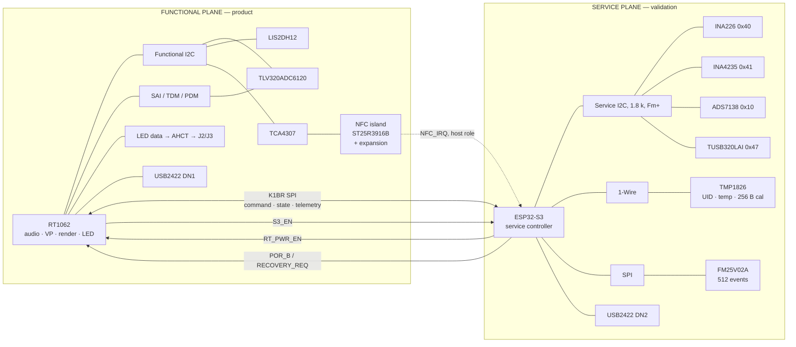
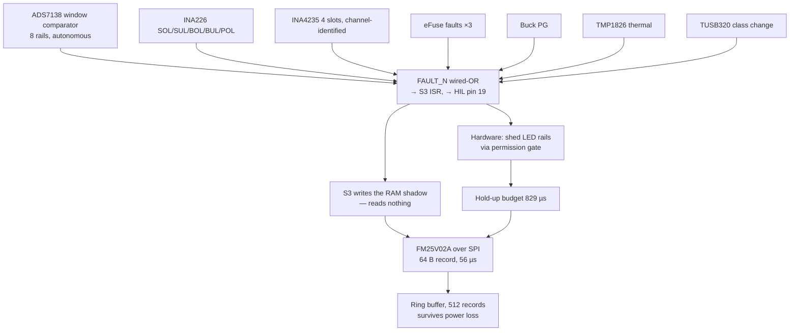
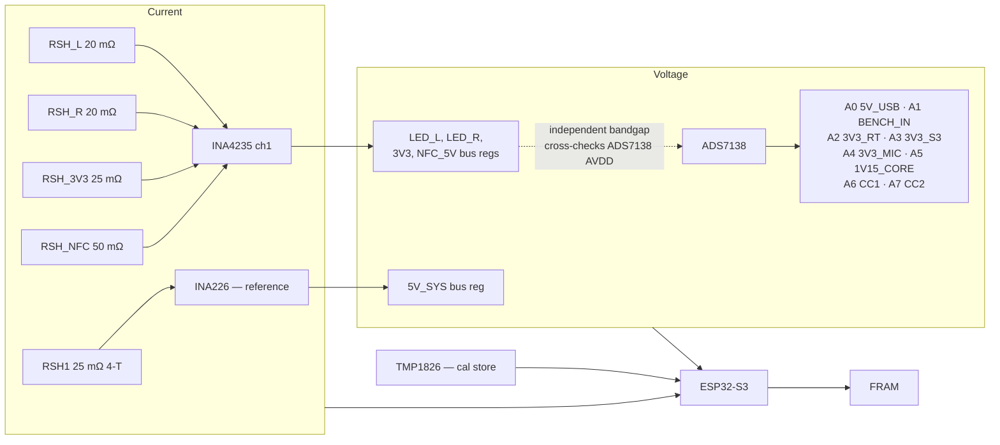

# K1-CORE-VAL-R0 — Full Electrical Architecture Optimisation Investigation

## 0. What changed the answer

Three inputs arrived after the previous sweep and they move the architecture materially.

**0.1 — The LED load is now a measured quantity, not an eFuse read-back.** Captain: *160 WS2816C-class
LEDs in a 1313 body per channel, two channels, never full white.* Worldsemi WS2816C-1313-4P V1.1
(2022-04-29) gives combined R+G+B output current of **10 / 10.5 / 11.5 mA** min/typ/max, plus
**IDDdyn 0.7 mA typ / 1.0 mA max** with outputs off. So:

| Condition | Per channel | Both channels |
| --- | --- | --- |
| Full white, worst case | **2.000 A** | **4.000 A** |
| Full white, typical | 1.792 A | 3.584 A |
| All dark, ICs powered | 0.160 A | 0.320 A |
| 40 % of full white | 0.896 A | 1.792 A |
| 25 % of full white | 0.620 A | 1.240 A |

The inherited 0.95 A "LED branch" figure was never a load. It was the LED eFuse ILIM setting read
back. The real ceiling is **4.2× larger**. Everything downstream of that number changes.

**0.2 — Source policy is "anything, degrade gracefully."** The board must enumerate and stay
diagnostically alive on a 500 mA laptop port, with high-load subsystems hardware-blocked until the
source proves it can feed them. That converts the Type-C question from an optimisation into a
requirement.

**0.3 — The uploaded `.epro2` is behind the repo.** `K1CoreValR0.epro2` (229 symbols) predates
D-049/D-050 and D-051: it still carries `J7-ESP`, has no USB2422, no CC ADC tap, no INA input
filter, no NTC bias, and its LED protection is `U17-PWR2` TPS2561. `schematic/visual-reference/sheets/domains.json`
is the current graph and is what this investigation is written against. Where the two disagree,
`domains.json` wins and the `.epro2` is treated as a stale export.

---

## 1. Executive recommendation

**S1+ / S2-ready is the right class, and it is confirmed — but the power-entry topology inside it
must change, and four of the pre-nominated parts do not survive.**

The CTO position is endorsed on: the S3 out-of-band service plane, INA226 plus a true four-terminal
shunt as the reference instrument, ADS7138 as the rail-awareness layer, TMP1826 for board identity,
persistent event recording, selective rather than blanket I²C isolation, target-impedance PDN,
RT hard-power-cycle designed in but bypassable, rejecting TPS389006 and TPS3435, and spending
freely on DNP infrastructure.

It is **not** endorsed on five points, each with a calculation behind it:

| # | CTO position | This investigation | Why |
| --- | --- | --- | --- |
| 1 | Single power entry, TPS2121 muxes it | **Split the inlet.** LED rail gets its own bench-preferred inlet; the mux sits only on the logic trunk | Both channels at full white plus the logic peak is **4.95 A**. TPS2121 is rated 4.5 A continuous and at 100 mΩ max-over-temp would dissipate 2.45 W into a 72.2 °C/W package — ΔT 177 °C. It is thermally destroyed by the real envelope. Split the inlet and the trunk falls to 0.95 A, where TPS2121 is comfortable |
| 2 | Bench injection is "gold", a debug convenience | **Bench power is the only way to run the LED experiment at all.** Not a convenience — the primary path for the headline measurement | 4.0 A of LEDs cannot come from any USB-C source. No source advertisement covers it |
| 3 | Automatic priority mux | **Manual priority only, with a mandatory 0R XOR bypass** | An automatic mux switches to USB the instant the bench rail sags — i.e. it destroys the brownout sweep, which is the single most valuable thing the bench inlet exists to do |
| 4 | FRAM on the service I²C bus | **FRAM on SPI** | The dying-gasp budget is 829 µs. A 64-byte record needs 630 µs at 1 MHz I²C and 1575 µs at 400 kHz. On SPI at 10 MHz it is 56 µs. It also removes the event recorder's dependence on the very bus whose failures it exists to log |
| 5 | TCA4307 on the experiment island, generally | **TCA4307 once, on the NFC/experiment island only. Domain-crossing isolation is TMUX1511, not TCA4307** | TCA4307 is single-VCC (SCPS270B) — it cannot translate or straddle two independently powered domains — and its 400 kHz SCL ceiling would cap the service bus below what the gasp needs. Two different jobs, two different mechanisms |

And two additions the CTO position does not contain, both of which are hard defects in the current
graph rather than opportunities:

- **The NFC block cannot operate as drawn.** ST DS13541 Rev 8 Tables 122/123 fix ΔV(VDD − VDD_TX) at
  **±0.2 V operating, ±0.3 V absolute maximum**, and §4.2.10 states plainly *"VDD and VDD_TX must be
  connected to the same power supply."* The graph has VDD on 3V3 and VDD_TX on NFC_5V — a 1.7 V split,
  5.7× the absolute maximum. `U12-NFC.1` must move to `NFC_5V`.
- **The buck's low-noise property is defeated by its own feedback divider.** TI SLVSFP4B §8.2.2.2.6:
  *"set R2 equal to or lower than 5 kΩ."* `R6-PWR2` is 32.4 kΩ — 6.5× over. The only reason to pay for
  a TPS62913 is the noise floor, and this resistor throws it away.

**Verdict: S1+ / S2-ready, with a split power inlet.**

---

## 2. Architecture delta

### Unchanged

RT1062 (MIMXRT1062DVJ6B, 196-ball, D-028 FROZEN) · ESP32-S3-WROOM-1-N16R8 · USB2422 single-receptacle
hub topology (D-049/D-050) · TPS62913 3V3 buck (silicon kept; support network changed) · TLV320ADC6120
dual-input audio (D-051) · ST25R3916B NFC, carrier-side front end, fixed match · LIS2DH12 motion ·
two electrically independent LED channels · TPS259474L-class eFuse protection · J1 GT-USB-7005A ·
six-layer 1.6 mm JLC06161H-3313 candidate · single-sheet schematic rule · K1BR command/state/telemetry.

### Changed

| Area | From | To |
| --- | --- | --- |
| Power entry | One USB-C inlet feeding everything | **Two inlets**: J1 USB-C → logic trunk; J-BENCH → LED rail (and, via the trunk mux, an alternative logic source) |
| Source selection | None | TPS2121 on the **logic trunk only**, manual-priority, with 0R XOR bypass. LED inlet selection is a populated-link XOR with reverse blocking on each leg |
| Source compliance | Nothing measures CC; LED branch unconditionally enabled | TUSB320LAI in pin mode + hardware permission gate. **Default-deny** before firmware runs |
| Main measurement | INA226 + WSHP2818 **two-terminal** 10 mΩ | INA226 + **WSK2512 25 mΩ, genuine four-terminal**, explicit Kelvin nets, replaceable |
| Branch measurement | None | INA4235, 4 channels: LED_L, LED_R, 3V3 output, NFC_5V |
| Rail measurement | None | ADS7138, 8 channels, autonomous window comparators |
| LED protection | TPS2561 dual, **shared die, shared ILIM, shared IN pins** | Two independent single-channel current-limited switches, ILIM 2.4 A each |
| NFC supply | VDD on 3V3, VDD_TX on NFC_5V (**illegal**) | VDD **and** VDD_TX on NFC_5V; VDD_IO stays 3V3 |
| Buck feedback | R1 100 k / R2 32.4 k | R1 15.4 k / R2 4.99 k (same 3.269 V, inside TI's 5 kΩ rule) |
| Buck configurability | S-CONF fixed | S-CONF as a selectable resistor position; EN/SYNC external-clock injection landing; DNP post-filter with XOR feedback point; DNP SW snubber |
| 3V3_RT | Not segmented | Load switch with **active output discharge**, 0R bypass, and eight domain-crossing signals isolated |
| Boot flash, boot straps, NTC bias | On always-on 3V3 | Moved into 3V3_RT (removes them as back-power paths at zero cost) |
| Service plane | None | S3-owned I²C (INA226, INA4235, ADS7138, TUSB320) + 1-Wire (TMP1826) + SPI (FRAM) |
| Board identity | None | TMP1826: 64-bit factory UID, ±0.2 °C local temperature, 256 B EEPROM |
| Event recording | None | FRAM on SPI, 64-byte records, ring buffer |
| Experiment routing | Solder links only | 2 × TMUX1574 (audio clock source; PDM route XOR). UART arbitration stays a physical link |
| I²C isolation | None | 1 × TCA4307 on the NFC/experiment island; 2 × TMUX1511 for domain crossing |
| Test access | Scattered TPs | Defined 20-pin HIL/pogo interface |

### Explicitly rejected

TPS389006 / TPS386000 global supervisor · TPS3435 external watchdog · NFC Automatic Antenna Tuning
provision · INA700-class integrated-shunt monitor for the reference measurement · resistor and
capacitor arrays · a mux on the RT UART arbitration path · independent S3 power switching.

---

## 3. System power envelope — recalculated from first principles

Every figure is tagged: **[DS]** primary datasheet · **[MEAS]** vendor measured app note ·
**[SET]** fixed by a component value on this sheet · **[BUDGET]** my allocation, stated so it can
be challenged · **[GRAPH]** read off a published curve.

### 3.1 The 3V3 rail

| Load | Sustained mA | Peak mA | Basis |
| --- | --- | --- | --- |
| RT1062 DCDC_IN | 53.1 | 110.0 | **[MEAS]** NXP AN12245 Table 7 · **[DS]** IMXRT1060CEC Rev 4 Table 12 |
| RT1062 VDD_HIGH_IN | 25.0 | 50.0 | **[DS]** IMXRT1060CEC Rev 4 Table 12 |
| RT1062 VDDA_ADC_3P3 | 0.75 | 40.0 | **[DS]** same |
| RT1062 VDD_SNVS_IN | 0.25 | 0.25 | **[DS]** same |
| RT1062 NVCC_GPIO/SD0/SD1/EMC | 20.0 | 30.0 | **[BUDGET]** — NXP publishes only `I = N·C·V·0.5F` |
| ESP32-S3-WROOM-1-N16R8 | 47.6 | **355.0** | **[DS]** Espressif v1.8 Table 6-6 / Table 6-4 |
| TLV320ADC6120, 3 channels | 18.0 | 20.0 | **[BUDGET]** scaled from **[DS]** SBASA92A (2 ch = 13.9 mA) |
| **USB2422 hub, HS host + 2 DN** | **70.0** | **89.0** | **[DS]** Microchip DS00001726B Table 5-1, IHCH2 |
| ST25R3916B VDD_IO only | 1.0 | 1.0 | **[BUDGET]** |
| LIS2DH12 | 0.011 | 0.011 | **[DS]** ST DocID025056 Rev 6 |
| INA226 | 0.33 | 0.42 | **[DS]** SBOS547C |
| INA4235 | 0.40 | 0.40 | **[DS]** SBOSAB5 |
| ADS7138 | 0.02 | 0.21 | **[DS]** SBAS976A |
| TMP1826 | 0.01 | 0.094 | **[DS]** SBOSA45D |
| TUSB320LAI | 0.10 | 0.10 | **[DS]** SLLSEN9F |
| TCA4307 ×1 | 2.50 | 4.50 | **[DS]** SCPS270B |
| TMUX1574 ×2 + TMUX1511 ×2 | 0.16 | 0.28 | **[DS]** SCDS391C / SCDS390B |
| Supervisors, pull-ups, TPs, headers | 15.0 | 25.0 | **[BUDGET]** |
| **3V3 TOTAL** | **254 mA** | **726 mA** | |

The single dominant term remains the S3 radio burst at 355 mA — 49 % of the peak. Parking Wi-Fi does
not help: BLE-MIDI TX peak is 344 mA **[DS]** Espressif v1.8 Table 6-5. The radio burst is irreducible.

Against the previous derivation (0.181 A / 0.648 A) the delta is: hub **+89 mA**, instrumentation
**+6 mA**, NFC VDD leaving the rail **−22 mA**, ADC channel count **+6 mA**.

**Recommended 3V3 design point: 0.85 A** (0.726 A + 17 %). TPS62913 is a 3 A device **[DS]** SLVSFP4B,
so the regulator is untroubled; the number matters for what it reflects upstream.

### 3.2 Reflected 5 V input to the buck

TPS62913 efficiency read from **[GRAPH]** SLVSFP4B Figure 8-5, 5 V in → 3.3 V out, 4.7 µH, 1 MHz:
94 % at 0.15 A, 97.4 % at 0.5 A, 97.2 % at 1.0 A. The prior 90 % **[BUDGET]** was pessimistic.

| | 3V3 out | P out | Efficiency | 5 V input |
| --- | --- | --- | --- | --- |
| Sustained | 0.254 A | 0.839 W | 94.0 % | **0.183 A** |
| Peak | 0.726 A | 2.397 W | 97.4 % | **0.497 A** |

### 3.3 Other 5 V branches

| Branch | Sustained | Peak | Basis |
| --- | --- | --- | --- |
| NFC (VDD **and** VDD_TX on NFC_5V) | 0.010 A | **0.350 A** | **[DS]** ST DS13541 Rev 8 Table 122: `IVDD_LDO` 350 mA, the internal VDD_RF regulator's own current limit. The 500 mA `IVDD_EXT` figure applies only when VDD_RF/VDD_DR are externally bypassed — not this topology |
| Mic LDO (TLV75533 → 3V3_MIC) | 0.050 A | 0.050 A | **[BUDGET]**; device max 500 mA **[DS]** SBVS320D |
| RT_USB_VBUS via TPS2052B | 0.025 A | 0.050 A | **[DS]** IMXRT1060CEC Table 12, 25 mA per active USB interface |

### 3.4 The two trunks

| | Logic trunk (J1 USB-C or bench) | LED inlet (bench preferred) |
| --- | --- | --- |
| Sustained | 0.268 A | 0.320 A (IC floor) |
| Coincident peak | **0.947 A** | **4.000 A** |
| Design point (+30 % / +8 %) | **1.23 A** | 4.3 A |

### 3.5 What each source can actually run

| State | Source | Peak draw | Headroom |
| --- | --- | --- | --- |
| Default USB 500 mA, LED rails OFF, radio + NFC TX inhibited | 0.500 A | 0.392 A | +0.108 A ✅ |
| Default USB 500 mA, LED rails OFF, radio TX permitted | 0.500 A | 0.947 A | −0.447 A ❌ |
| Default USB 500 mA, LED ICs powered but dark | 0.500 A | 1.267 A | −0.767 A ❌ |
| 1.5 A source, LED rails OFF, everything else free | 1.500 A | 0.947 A | +0.553 A ✅ |
| 1.5 A source, both channels at 10 % | 1.500 A | 1.635 A | −0.135 A ❌ |
| 3.0 A source, both channels at 25 % | 3.000 A | 2.187 A | +0.813 A ✅ |
| 3.0 A source, both channels at 40 % | 3.000 A | 2.739 A | +0.261 A ✅ |
| 3.0 A source, both channels FULL WHITE | 3.000 A | 4.947 A | −1.947 A ❌ |
| Bench 5 A, both channels FULL WHITE | 5.000 A | 4.947 A | +0.053 A ⚠️ |

Read that table twice. **There is no USB-C source that can run this LED system at full output.** A
3.0 A advertisement covers roughly 40 % duty on both channels and nothing more. The bench inlet is
not an optional laboratory nicety; it is the only path to the experiment the board exists to run.

And on a Default-USB port the board is only viable with the radio and NFC transmitters inhibited as
well as the LEDs. That is a three-tier permission structure, not a two-tier one.

### 3.6 Hardware power-permission tiers

| Tier | Gate condition | Enables |
| --- | --- | --- |
| **T0** | Always (default, before firmware) | RT1062, S3, hub, audio, motion, all instrumentation. Radio TX duty-limited, NFC TX inhibited, both LED rails **OFF** |
| **T1** | TUSB320 reports 1.5 A **or** BENCH_VALID | + radio TX unrestricted, + NFC TX |
| **T2** | TUSB320 reports 3.0 A **or** BENCH_VALID | + LED rails enabled, firmware duty cap applied |
| **T3** | BENCH_VALID **and** LED inlet on bench | + LED duty cap released to full white |

The T0 default falls out of the silicon for free: TUSB320LAI's OUT1/OUT2 read **HH = unattached**
at power-on with no firmware **[DS]** SLLSEN9F Table 7-3, and the decode asserts LED_PERMIT only on
the specific 3.0 A code. Default-deny is structural, not a firmware promise.

---

## 4. Mandatory investigation areas — findings

### A. System power envelope — is TPS2121 adequate?

**No, not as the single trunk mux.** The question the brief forced was whether 4.5 A is remotely
sensible against the real K1 envelope. It is not, on a single inlet:

| Ron | 2.4 A | 3.0 A | 4.95 A (both channels full white + logic) |
| --- | --- | --- | --- |
| 56 mΩ typ 25 °C **[DS]** | 323 mW, ΔT 23 °C | 504 mW, ΔT 36 °C | 1.37 W, ΔT 99 °C |
| 70 mΩ max 25 °C **[DS]** | 403 mW, ΔT 29 °C | 630 mW, ΔT 46 °C | 1.72 W, ΔT 124 °C |
| 100 mΩ max −40…125 °C **[DS]** | 576 mW, ΔT 42 °C | 900 mW, ΔT 65 °C | **2.45 W, ΔT 177 °C** |

θJA = 72.2 °C/W, VQFN-HR 12-pin 2.0 × 2.5 mm **[DS]** SLVSEA3F Table 7.4. At 4.95 A the part is over
its 4.5 A continuous rating *and* thermally destroyed. At 0.95 A on a split logic trunk it dissipates
90 mW and rises 7 °C.

Second finding: **TPS2121's current limit is useless as policy at our current level.** SLVSEA3F
Table 7.5 gives RILM 44.2 kΩ → 2.0 / 2.5 / 3.0 A (±20 %) and RILM 80 kΩ → 1.0 / 1.5 / 2.0 A (±33 %).
Nothing with a ±20–33 % band can enforce a source budget. Its value is the switch, the fast reverse-
current blocking (§9.3.6) and the Hi-Z-when-both-inputs-invalid behaviour (Table 9-2) — not the limit.

**Verdict: ADOPT for the logic trunk only, in manual-priority mode, with a mandatory 0R XOR bypass.**

Alternatives checked and their disposition: TPS2116 / LM66200 (2.5 A, SOT-8, θJA 111.5 °C/W) — adequate
for the split trunk and cheaper, but no manual priority pin, so they cannot be forced during a sweep:
**REJECT**. TPS2115A / TPS2113A — 1.25–2.5 A abs-max with a dissipation-rating table rather than a
modern thermal model, 84 mΩ typ: **REJECT**. LTC4415 (dual 4 A ideal diodes, VIN 1.7–5.5 V, 50 mΩ) —
selection is via EN-pin thresholds and external dividers, not a priority pin; genuinely a candidate
if TPS2121's manual mode disappoints: **RESERVE as the named fallback**. MAX17614 — VIN min 4.5 V
leaves 0.5 V of headroom on a 5 V rail and its 130 mΩ is characterised at VIN > 8 V: **REJECT**.
Ideal-diode controllers with external FETs (LM74700-Q1, LM5050-1, LTC4412) — LM5050 needs VBIAS below
5 V, and all of them add a FET plus gate network for capability we do not need once the LED rail is
off the trunk: **REJECT**.

### B. Bench-power architecture

The requirement list decomposes into two genuinely different problems, and merging them is what makes
a single mux look mandatory.

**Problem 1 — logic trunk source selection.** Needs: USB data attached while bench powers the logic;
host attach/detach without dropping the rail; no backfeed into the host. TPS2121 in manual-priority
mode does all three. Automatic mode does *not* satisfy the brownout sweep, because it will fail over
to USB the moment the bench rail sags below the USB rail — masking the exact event under study.

**Problem 2 — LED rail source selection.** Needs: 4.3 A capability; deterministic, non-failing-over
selection; reverse blocking. This is a bench configuration set once per session, not a runtime
decision. A **populated-link XOR with a reverse-blocking element on each leg** is honest, has zero
Ron uncertainty, and physically cannot fail over mid-measurement. A software-selectable LED source is
a way to backfeed a laptop by accident.

```
  J1 USB-C ── ESD ── eFuse(TPS259474L, ILIM 1.5 A) ── 5V_PROTECTED ─┐
                                                                    ├─ TPS2121 ─ RSH1(25 mΩ, 4-T) ─ 5V_SYS
  J-BENCH ── reverse block ── eFuse ── BENCH_PROTECTED ─────────────┘   PRI ← switch/S3
       │                                          (0R XOR bypass across the mux, both legs)
       └── LED-SOURCE XOR link ── LED eFuse L (2.4 A) ── RSH_L ── +5V_LED_L
                        │       └─ LED eFuse R (2.4 A) ── RSH_R ── +5V_LED_R
       (alternative XOR leg: 5V_PROTECTED, for USB-powered LED operation under T2 cap)
```

External current limiting is the bench supply's own; controlled brownout is a bench-supply voltage
sweep with the mux forced to BENCH; startup profiling is the bench inlet's inrush through the LED
eFuse's own dV/dt with the ADS7138 watching 5V_SYS and 1V15_CORE.

**Verdict: ADOPT the split-inlet bench architecture.**

### C. Main input measurement — INA226 vs INA700-class

**Keep INA226 with an external four-terminal shunt. REJECT INA700-class for the reference measurement.**

The reason is not sentiment, it is that the integrated-shunt parts trade away exactly the properties
that make a reference instrument a reference:

| | INA226 + WSK2512 | INA700 | INA745B |
| --- | --- | --- | --- |
| Shunt value | Chosen; **replaceable** | 2 mΩ fixed | 800 µΩ fixed |
| Shunt tolerance | ±0.5 % **[DS]** doc 30108 | not published as % | not published as % |
| Shunt TCR | **±35 ppm/K** (5–200 mΩ bracket) | ±50 ppm/°C gain drift | Fig 6-1 shows Rpin 0.4–1.8 mΩ over −50…150 °C |
| Kelvin | External, explicit, probeable | **Single IN+/IN− pair, no Kelvin pins** | IS±/SH± split |
| Independently checkable | Yes — put a DMM on the shunt | No | No |
| Calibration | Board-specific, stored in NVM | Factory only | Factory only |

The INA700's construction is the disqualifier: its load current and its sense signal share one pin
pair, so board copper and solder-joint resistance enter the measurement and cannot be separated from
it. That is acceptable in a product. It is not acceptable in the device the rest of the board's
measurements will be calibrated against.

**The present shunt is the wrong part.** `WSHP2818R0100FEA` (Vishay doc 30347, rev 07-Dec-2023) is a
**two-terminal** power metal strip. Its datasheet's "Sensing with Via Layout (best performance)"
figure is a PCB technique for approximating four-wire sensing — not a fourth pin. The repo's
"true four-terminal external shunt" requirement is not met by it.

**Specification:**

| Parameter | Value | Basis |
| --- | --- | --- |
| Part | **Vishay WSK2512 R025 F** (0.025 Ω, ±1 %; ±0.5 % grade available) | doc 30108 rev 11-Dec-2023, title: *"…Surface-Mount, 4-Terminal"* |
| Resistance | 25 mΩ | derived below |
| Full-scale current | 3.28 A (81.92 mV / 25 mΩ) | **[DS]** SBOS547C |
| Resolution | 100 µA (2.5 µV LSB) | **[DS]** SBOS547C |
| Offset-limited floor | ±0.40 mA (10 µV max offset) | **[DS]** SBOS547C |
| Dissipation at trunk peak 0.95 A | 23 mW | calculated |
| Dissipation at eFuse max trip 1.66 A | 69 mW (of 1 W at 70 °C) | calculated |
| Drop at trunk peak | 23.8 mV | calculated |
| TCR | ±35 ppm/K | doc 30108 |

**Why 25 mΩ and not 10 mΩ.** The binding constraint is that the *trip itself* must stay on-scale —
if the eFuse's maximum trip current saturates the reference instrument, the most interesting event on
the board is unmeasurable. Trunk eFuse max trip is 1.66 A, so R ≤ 81.92 mV / 1.66 A = 49.3 mΩ.
Within that, larger is better for resolution. 25 mΩ gives 2× headroom over the trip, 2.5× the
resolution of the present 10 mΩ, and 24 mV of drop — acceptable against a trunk that no longer
carries the LED current.

Input filter per **[DS]** SBOS547C §6.4.2: series ≤10 Ω on IN+ and IN−, 0.1–1 µF differential.
`RINA_P-PWR1` / `RINA_N-PWR1` already exist in the current graph; specify **10 Ω 0402** and **1 µF**.
Kelvin nets `RSH1_KELVIN_P` / `RSH1_KELVIN_N` broken out as named nets so VAL-G3 inherits a
constraint rather than a hope (**[DS]** SBOS547C §8.4.1).

### D. Branch current telemetry — INA4235

**INA4235 exists and is the right part.** TI SBOSAB5, May 2024, production data: 48 V quad-channel
16-bit current/voltage/power/energy monitor, ±81.92 mV or ±20.48 mV shunt full scale (2.5 µV / 625 nV
LSB), 0–52.4 V bus at 1.6 mV LSB, common mode −0.3 to +48 V, 16 I²C addresses, 400 µA, DSBGA-16
1.5 × 1.5 mm.

**Do all four channels earn their place? Yes — but not the four that were nominated.** The CTO
allocation was LED_L, LED_R, 3V3, NFC/aux. Channel 3 should measure the **3V3 buck output**, not its
5 V input, because a channel returns both current *and* bus voltage: measuring the output yields
`3V3_MAIN` current and `3V3_MAIN` voltage in one channel, which then frees an ADS7138 channel that
would otherwise have been spent on 3V3. Measuring the input yields a number you can already infer
from the output and the efficiency curve.

| Ch | Branch | I max | Shunt | ADCRANGE | FS margin | Resolution | Dissipation | Drop |
| --- | --- | --- | --- | --- | --- | --- | --- | --- |
| 1 | `+5V_LED_L` | 2.000 A | **20 mΩ** | 0 (±81.92 mV) | 40.0 mV of 81.92 (49 %) | 125 µA | 80 mW | 40 mV |
| 2 | `+5V_LED_R` | 2.000 A | **20 mΩ** | 0 | 49 % | 125 µA | 80 mW | 40 mV |
| 3 | `3V3_MAIN` (buck output) | 0.726 A | **25 mΩ** | 1 (±20.48 mV) | 18.2 mV of 20.48 (89 %) | 25 µA | 13 mW | 18 mV |
| 4 | `NFC_5V` | 0.350 A | **50 mΩ** | 1 | 17.5 mV of 20.48 (85 %) | 12.5 µA | 6 mW | 18 mV |

Common-mode compatibility: all four sit at 3.3–5.0 V, far inside the −0.3 to +48 V window. Alert:
one shared open-drain pin, but **per-channel identifiable** — four independently assignable alert
slots with a CHANNEL field and separate `LIMIT1..4_ALERT` bits in the Flags register (**[DS]**
SBOSAB5 Tables 7-8 and 7-20). That matters: a wired-OR alert whose source cannot be identified would
have been a genuine reason to reject the part.

Layout implication: the LED shunts carry 2 A each. They are Kelvin-sensed 0805/1206 parts on the LED
pour, and the sense pair routes as a tight differential back to the DSBGA — which must therefore be
placed on the LED side of the board, not in the instrumentation cluster. **This is the one place
where the measurement architecture constrains the floorplan, and it should be recorded as a VAL-G3
input.**

Alternatives: INA3221 (3 channels, 13-bit, 40 µV LSB) — one channel short and 16× coarser: **REJECT**.
Four × INA226/INA236 — four addresses, four placements, four times the routing, and no shared alert
logic: **REJECT**. PAC1934/PAC1954 (4 channels, 16-bit, two alert pins on the '54) — genuinely
competitive; rejected on the narrower 0–32 V common mode and a resistor-strap address scheme that is
less deterministic than pin-strapping: **REJECT, recorded as a live alternative**.

**Verdict: ADOPT.**

### E. Rail telemetry ADC — ADS7138

**ADOPT.** It is the only device in its class with genuinely autonomous multi-channel threshold
monitoring: per-channel `HIGH_TH_CHx`/`LOW_TH_CHx`, a 4-bit hysteresis field, a programmable
`EVENT_COUNT` debounce, and an ALERT pin that fires with the host asleep (**[DS]** SBAS976A
§8.6.18–8.6.22). Of the alternatives surveyed, only ADS7128 matches it (same DWC architecture,
180 kSPS instead of 1 MSPS). ADS1115 alerts autonomously but only on the single channel its mux is
parked on. TLA2528, TLA2518, MCP3428, MAX11615 and LTC2497 have **no** autonomous window comparator
at all and require host polling — which defeats the entire purpose.

**The critical unpublished number, derived.** TI publishes no maximum source impedance for the
ADS7138 — confirmed absent from SBAS976A by direct search. It does publish CSH ≈ 12 pF (§7.5),
RSW ≈ 150 Ω (§8.3.1) and tACQ = 300 ns max (§7.7). Settling to 1 LSB of 12 bits needs
ln(2¹²) = 8.32 time constants:

```
  τ_max     = 300 ns / 8.32          = 36.1 ns
  R_total   = 36.1 ns / 12 pF        = 3006 Ω
  R_source  = 3006 − 150             = 2856 Ω    ← the number TI does not print
```

**Without a local reservoir capacitor no divider may exceed ~2.6 kΩ Thévenin resistance.** With one,
the acquisition draws from the local cap and the binding constraint becomes inter-conversion recharge
instead:

| C_flt | R_source | Charge-share step | 9τ recharge | Max per-channel rate |
| --- | --- | --- | --- | --- |
| 1 nF | 10 kΩ | 1.19 % | 90 µs | 11.1 kSPS |
| 1 nF | 100 kΩ | 1.19 % | 900 µs | 1.11 kSPS |
| 10 nF | 100 kΩ | 0.12 % | 9.0 ms | 111 SPS |

**Rule for every ADS7138 channel: C_flt ≥ 1 nF (83 × CSH) at the pin, and per-channel sample period
≥ 9 · R_source · C_flt.** That rule is what lets high-impedance dividers be used at all, and it is
the reason the CC channels below work.

**Channel allocation — the budget resolved.** There were more candidates than channels. Four of the
nominated candidates are already covered by bus-voltage readings on the INA parts and are therefore
struck:

| Candidate | Disposition |
| --- | --- |
| `5V_SYS` | **Struck** — INA226 bus-voltage register, 1.25 mV LSB |
| `3V3_MAIN` | **Struck** — INA4235 ch3 bus voltage |
| `NFC_5V` | **Struck** — INA4235 ch4 bus voltage |
| `+5V_LED_L/R` | **Struck** — INA4235 ch1/ch2 bus voltage |

| Ch | Signal | Conditioning | Why it is here |
| --- | --- | --- | --- |
| A0 | `5V_USB` (inlet, pre-eFuse) | 100 k / 100 k + 1 nF | The only view of what the host is actually delivering, upstream of our own protection |
| A1 | `BENCH_IN` | 200 k / 100 k + 1 nF (3:1, 9.9 V FS) | The swept variable in every brownout and startup experiment |
| A2 | `3V3_RT` | 100 k / 100 k + 1 nF | Proves the RT power-cycle actually happened, and how fast |
| A3 | `3V3_S3_FILTERED` | 100 k / 100 k + 1 nF | The service plane watching its own supply — the last thing to sag before the instrument dies |
| A4 | `3V3_MIC` / audio | 100 k / 100 k + 1 nF | Audio-lane supply during LED and NFC activity; directly serves the interference matrix |
| A5 | **`1V15_CORE`** | **direct, 1 nF only** | The RT's internal DCDC output. This is the rail that actually browns out the CPU, and nobody nominated it |
| A6 | `USB_CC1` | **100 k series + 1 nF, no divider** | Raw advertisement voltage |
| A7 | `USB_CC2` | **100 k series + 1 nF, no divider** | Raw advertisement voltage + orientation cross-check |

Divider dissipation: five 200 kΩ dividers at ≤10 V draw ≤50 µA each, ≈1 mW total. Source impedance
50 kΩ Thévenin, well inside the C_flt rule at any sensible scan rate.

**Reference behaviour is a real limitation and must be stated.** The ADS7138 has **no internal
reference** — it uses AVDD (**[DS]** SBAS976A §8.3.2), and TI publishes no accuracy figure for that
path. Absolute accuracy is therefore bounded entirely by 3V3 regulation and noise. Two consequences:
(a) AVDD must come from a quiet point on 3V3 with its own RC/ferrite; (b) every ADS7138 reading is
ratiometric to 3V3, so **3V3 itself must be measured by something else** — which the INA4235 ch3 bus
voltage does, on its own bandgap. That closes the loop and is a genuine reason the two devices are
not redundant.

Safe maximum input: GND − 0.3 V to AVDD + 0.3 V (**[DS]** §7.1). With 100 kΩ series on CC, a CC-to-VBUS
fault at 20 V injects 200 µA into the clamp — survivable.

**What the autonomous watchdog can and cannot detect.** With `DWC_EN=1` and auto-sequence running,
the device free-runs and asserts ALERT without host involvement. Detectable: undervoltage and
overvoltage on any of the eight channels; 3V3_RT failing to come up after a commanded cycle;
1V15_CORE sagging under load; CC advertisement changing (host renegotiation or cable pull); bench
supply reaching a sweep limit. **Not** detectable: anything faster than the scan. At full 1 MSPS
auto-sequence, eight channels take 8 µs per pass. A 3V3 rail collapsing at 1562 V/s (§13 below)
crosses a 100 mV window in 64 µs — eight scans. **At a slow scan rate the coverage is illusory.**
Firmware requirement, not a suggestion: run the auto-sequence fast. It costs 210 µA.

### F. Separate S3 service fabric

**ADOPT.** The separation is the strongest idea in the CTO position and the calculations support it.

| Device | Bus | Address | Voltage | Owner | Alert | Power domain |
| --- | --- | --- | --- | --- | --- | --- |
| INA226 (trunk) | Service I²C | 0x40–0x4F, 16 options **[DS]** SBOS547C Table 6-2 | 3V3 | S3 | `INA_ALERT_MAIN` | Always-on |
| INA4235 | Service I²C | 0x40–0x4F, 16 options **[DS]** SBOSAB5 Table 6-1 | 3V3 | S3 | `INA_ALERT_BRANCH` | Always-on |
| ADS7138 | Service I²C | 0x10–0x17, ADDR resistor **[DS]** SBAS976A Table 2 | 3V3 | S3 | `ADC_ALERT` | Always-on |
| TUSB320LAI | Service I²C | **0x47 fixed** **[DS]** SLLSEN9F | 3V3 | S3 (read-only; pin mode is authoritative) | `TUSB_INT_N` | Always-on |
| TMP1826 | **1-Wire** | 64-bit ROM ID | 3V3 | S3 (RMT peripheral) | IO2 alert | Always-on |
| FRAM | **SPI** | CS | 3V3 | S3 | — | Always-on |

**Address conflict, found and closed:** TUSB320LAI is hard-fixed at 0x47, which sits inside the
INA 0x40–0x4F block. Strap INA226 and INA4235 away from 0x47. Trivial, but it would have been a
bring-up morning.

**Bus budget:** five I²C pin loads at 8–10 pF plus ~25 pF of trace ≈ **75 pF**. Rise time
`tr = 0.8473 · Rp · C`:

| Rp | tr | 400 kHz (300 ns) | 1 MHz Fm+ (120 ns) |
| --- | --- | --- | --- |
| 4.7 kΩ | 299 ns | marginal | fail |
| 2.2 kΩ | 140 ns | pass | fail |
| **1.8 kΩ** | **114 ns** | **pass** | **pass** |

**Specification: 1.8 kΩ pull-ups, Fast Mode Plus capable.** Sink current 1.83 mA, inside every
device's 3 mA capability.

**Do not put TCA4307 on this bus.** Its maximum SCL is 400 kHz (**[DS]** SCPS270B §5.6), which would
cap the service bus below Fm+ and add 60–100 mV of VOS for no benefit — nothing on the service bus
is power-switched or removable. TCA4307 belongs on the functional bus's experiment island (§G).

**Which peripherals do NOT belong here.** The audio codec, the IMU and the NFC controller are
product-functional devices on the RT's bus. Moving them to the service bus because they happen to
speak I²C would make the S3 a dependency of product function — the exact failure the whole separation
exists to prevent. The one debatable case is the NFC controller, whose *host* is the S3 by the
ownership matrix. **Ruling: NFC stays on the functional bus behind the TCA4307 island, and the S3
reaches it through the functional bus.** Keeping the S3's service-plane role and its NFC-host role on
different buses is what preserves the meaning of the plane separation: if the functional bus wedges,
NFC dies but the instrument does not.

**Why FRAM is on SPI and not here.** Three reasons, in order of weight: (1) the dying-gasp budget
(§13) does not close over I²C; (2) an event recorder that logs I²C failures must not be on the I²C
bus; (3) it frees an address and removes the FM24V10's awkward 4-address limit from the budget.

**Bus recovery and test access:** service SDA/SCL, ALERT lines and the 1-Wire go to the HIL interface
(§X), so a fixture can drive the service plane with both processors held in reset.

### G. Functional I²C isolation

**Do not buffer the whole RT functional bus.** The current bus carries `U11-AUD` (codec),
`U13-MOT` (IMU), `U12-NFC` (NFC) and `U2-PWR1`, with both `U6-RTC` and `U9-ESP` attached. Two
distinct problems live on it, and they need two different mechanisms:

**Problem 1 — a peripheral wedges the bus.** The realistic candidate is NFC: it is the device most
likely to be power-cycled, reconfigured or experimentally removed, and the ST25R3916B is the device
whose supply architecture is being changed. **TCA4307, one instance, on the NFC/experiment island.**

| Property | Value | Basis |
| --- | --- | --- |
| Stuck-bus trigger | SDAOUT or SCLOUT low for 25–65 ms (40 ms typ) | **[DS]** SCPS270B §7.3.7 |
| Recovery | up to 16 pulses on SCLOUT at 5.5–14 kHz | §7.3.7 |
| Powered-off | *"When the supply voltage is below the UVLO threshold, the I2C and digital I/O pins are a high impedance state"* | §7.3.5 |
| Rise-time accelerator | 2–5 mA; constrains Rp ≤ 45 kΩ at 3.3 V | §8.2.2, Eq. 1 |
| Pin capacitance | 5–10 pF/pin | §5.5 |
| VOS introduced | 60–100 mV | §5.5 |
| Max SCL | **400 kHz** | §5.6 |
| Voltage domains | **Single VCC — no translation** | §5.3 |

A second, useful property falls out for free: with the island unpowered, the island-side devices' ESD
clamps pull the buffered side toward 0.7 V, TCA4307 reads a stuck bus, exhausts its 16 pulses and
disconnects. **An unpowered island auto-isolates.** That is the behaviour we wanted and it costs
nothing extra.

**Problem 2 — a signal crosses into an unpowered domain.** TCA4307 cannot do this job: it is
single-VCC, so it cannot straddle 3V3 and 3V3_RT. TCA9617B *can* translate two domains but has **no**
stuck-bus recovery. There is no single part that does both. **Use TMUX1511** — four SPST channels,
Ron 2 Ω, Coff 2.5 pF, and a verified powered-off clause: *"Up to 3.6 V on the signal path of the
TMUX1511 provides isolation when the supply voltage is removed (VDD = 0 V). Without this protection
feature, switches can back-power the supply rail through an internal ESD diode"* (**[DS]** SCDS390B).
IPOFF ±2 µA. Internal 6 MΩ pull-downs mean it powers up open, and its Fail-Safe Logic accepts control
voltages before VDD.

**Proposed topology:**

```
                             RT functional I2C (3V3, 1.8 k pull-ups)
   U6-RTC ──[TMUX1511 #1 ch1,ch2]──┬── U11-AUD codec
        (VDD = always-on 3V3,      ├── U13-MOT IMU
         EN  = RT_PWR_EN)          ├── U2-PWR1  (legacy tap, see note)
                                   ├── U9-ESP  (second master, XOR'd by 0R)
                                   │
                                   └──[TCA4307]── NFC / EXPERIMENT ISLAND
                                        EN = S3 GPIO      ├── U12-NFC
                                        VCC = always-on   └── expansion header
```

Note: `U2-PWR1` (INA226) appears on the functional bus in the current graph. It moves to the service
bus. That is part of the plane separation, not an extra change.

**Verdict: ADOPT — 1 × TCA4307 (island), 2 × TMUX1511 (domain crossing, see §H). REJECT blanket
buffering of the functional bus.**

### H. RT1062 independent power cycling

**ADOPT — the partial-power-down analysis closes, but only after four specific moves.**

**H.1 The back-power problem, quantified.** With `3V3_RT` off and everything else alive, these paths
inject into the dead domain through the RT's ESD clamps:

| Path | Mechanism | Current |
| --- | --- | --- |
| `FLEXSPI_D1` — U8 flash driving MISO | push-pull, no series R | ~60 mA (driver Ron limited) |
| `MOTION_INT` — IMU driving INT | push-pull, 0 Ω | ~60 mA |
| `ESP_UART0_TX` → RT RX via R58 0 Ω | push-pull, 0 Ω | ~60 mA |
| `AUDIO_DOUT` — ADC6120 driving TDM out via R37 22 Ω | series 22 Ω | **118 mA** |
| `K1BR_MISO_S3` via R25 22 Ω | series 22 Ω | **118 mA** |
| `K1BR_IRQ_S3` via R27 22 Ω | series 22 Ω | **118 mA** |
| SWD debugger driving SWDIO via R16 22 Ω | external | **118 mA** |
| `I2C_SDA`/`SCL` pull-ups 4.7 k on 3V3 | passive | 1.1 mA |
| NTC bias `RNTC_L/R` 10 k on 3V3 | passive | 0.52 mA |
| Boot straps + reset pull-ups on 3V3 | passive | 0.78 mA |
| ADS7138 divider top leg 100 k | passive | 0.036 mA |
| **Total** | | **≈ 0.55 A** |

**A 22 Ω series resistor is not an isolation mechanism.** It is a termination. At 118 mA per line, three
such lines alone fully power the RT domain. And discharge cannot fix it: 0.55 A into even a 100 Ω
active discharge would sit the rail at 55 V nominal — i.e. the rail simply comes up. Discharge is a
residue-handler, not a defence.

**H.2 The four moves that close it.**

1. **Move into `3V3_RT` at zero cost** — boot flash `U8-RTDBG`, boot-mode straps `R11`/`R12`, reset
   pull-up `R14`, NTC bias `RNTC_L`/`RNTC_R`. These are the RT's own peripherals and belong in its
   domain anyway. Removes 3 paths and ~61 mA. Bonus: the flash is power-cycled with the RT, which is
   what you want for a clean cold-boot experiment.
2. **Isolate the six remaining active crossings** with `2 × TMUX1511`, VDD on always-on 3V3, EN driven
   by `RT_PWR_EN` (open = isolated):
   `I2C_SDA`, `I2C_SCL`, `AUDIO_DOUT`, `MOTION_INT`, `K1BR_MISO_S3`, `K1BR_IRQ_S3`,
   `ESP_UART0_TX→RT_RX`, + 1 spare.
3. **Gate `TPS2052B` EN with `RT_PWR_EN`** so `RT_USB_VBUS` — a real 5 V analogue pin with a 5.50 V
   absolute maximum (**[DS]** IMXRT1060CEC) — falls with the domain.
4. **Load switch with active output discharge**, mandatory. After moves 1–3 the residue is the
   36 µA ADS7138 divider; at a 200 Ω discharge that is **7.2 mV**. Closed.

**H.3 The sequencing requirement nobody has stated.** NXP IMXRT1060CEC §4.2.1.1 uses "must":
*"Delay from DCDC_IN stable at 3.0 V min to DCDC_PSWITCH reaching 0.5 × DCDC_IN (1.5 V) must be at
least 1 ms,"* with a total RC delay of 5–15 ms. **On a re-power, that RC must have discharged, or the
sequencing requirement is silently violated on the second and every subsequent cycle.** The load
switch's active discharge must therefore pull down `3V3_RT` fast enough that the DCDC_PSWITCH RC
network drains between cycles, and firmware must enforce a minimum off-time of ≥5 × the RC time
constant. **This is the specific thing that would have made the feature quietly unreliable.**

**H.4 The SWD hazard.** An attached debugger drives SWDIO/SWCLK from its own supply through 22 Ω.
It is outside our control. **Documented hazard: do not command an RT power cycle with a debug probe
attached, or fit the two optional TMUX1511 channels on the SWD stub.** Recorded, not silently ignored.

**H.5 Bypass.** `RT_BYPASS` 0R across the load switch, DNP by default with the switch fitted; XOR, not
parallel. With the 0R fitted and the switch DNP, `3V3_RT` becomes `3V3` and the board reverts exactly
to product topology. That is the clean-removal path a production derivative needs.

**H.6 The S3 is not switched.** Endorsed without reservation. Do not put a remote-control scuttling
charge on the lifeboat.

### I. Active experiment routing

**TMUX1574 topology, first, because it changes the design.** SCDS391C: *"Low-Capacitance, 2:1 (SPDT)
4-Channel."* Four SPDT switches with **one shared SEL pin** plus EN — not four independent selects.
That is a constraint, and it happens to be a helpful one: it forces grouping signals that should
switch together.

| Parameter | Value | Basis |
| --- | --- | --- |
| Bandwidth (−3 dB) | 2 GHz | **[DS]** SCDS391C §7.15 |
| Ron | 2 Ω typ / 4.5 Ω max, flatness 1.8 Ω max | Table 6.5 |
| Con / Coff | 7.5 / 3.5 pF typ | Table 6.6 |
| Charge injection | 3.5 pC | Table 6.6 |
| Off-isolation | −90 dB @ 100 kHz, −75 dB @ 1 MHz | Table 6.6 |
| Powered-off | *"Powered-off protection up to 3.6 V… provides isolation when the supply voltage is removed"* | §8.3.4 |
| Default state | Internal 6 MΩ pull-down on SEL/EN → known state at power-on | §8.3.5 |
| Fail-safe logic | Control voltages may be applied before VDD | §8.3.5 |
| **THD+N** | **Not published** | — |

**ADOPT ×2:**

| Device | Channels (switch together) | Positions | Default (SEL low) |
| --- | --- | --- | --- |
| **TMUX1574 #1** — audio clock source | `AUDIO_MCLK`, `AUDIO_BCLK`, `AUDIO_FSYNC`, + 1 instrumentation trigger | RT-generated ↔ external `J8-AUD` | RT-generated |
| **TMUX1574 #2** — PDM route XOR | `PDM_CLK`, `PDM_DATA`, + 2 instrumentation capture | ADC6120 PDM input ↔ direct RT SAI | ADC6120 (FIT default per D-051) |

Both defaults come free from the 6 MΩ pull-down, so the FIT configuration is the boot state with no
firmware. The XOR is structural — the mux physically cannot connect both routes.

Signal integrity check on the PDM path: 3.072 MHz clock and data through 2 Ω / 3.5 pF Coff. The RC
formed with a 22 Ω series termination is 22 × 11 pF = 0.24 ns against a 325 ns bit period. Off-isolation
at 1 MHz is −75 dB. **The mux is not a limitation on this path.** On the 24.576 MHz BCLK family the
margin is still 40 ns of edge against a 40 ns period — comfortable but it is the tightest case, and
worth confirming on the bench (see Experiment E-4).

**REJECT for the analogue AUX path.** THD+N is not published for TMUX1574, TMUX1511 or TMUX1109. A
2.0 Vrms consumer line input into an unspecified-distortion switch is exactly the kind of unforced
error that would contaminate every converter measurement the board exists to make. The AUX
consumer/differential population stays a 0R XOR, per the audio contract.

**REJECT for UART arbitration.** `contracts/debug-fabric.md` requires *"a completely ESP32_S3-independent
physical takeover path, electrically overriding any software selection."* A mux whose SEL comes from
the S3 is, definitionally, not that. A 2-position 0R XOR plus the fitted `J5-RTDBG` header satisfies
the requirement with no silicon. This is the one place where the solder operation is the feature.

**REJECT TMUX1109** for any domain-crossing use: its fail-safe clause covers only the control pins,
not the signal path (**[DS]** SCDS406A §6.3.4) — unlike its TMUX1511/1574 siblings. Selecting it by
part-number proximity would be a silent defect.

**REJECT TS5A3159 and SN74LVC1G3157** for anything crossing a power boundary: neither has a
powered-off isolation clause; their Ioff specs are measured with VCC applied.

### J. Type-C architecture

**ADOPT TUSB320LAI as the authoritative Type-C state machine, and retain raw CC telemetry. Both, not
either.**

**Why a controller at all.** The present discrete architecture cannot classify. It has Rd, and now
`USB_CC1_ADC_TAP`/`USB_CC2_ADC_TAP` in the current graph — but an ADC reading of a CC voltage is not a
state machine. It cannot debounce attach, cannot resolve orientation deterministically, cannot
survive the ADC being unconfigured, and above all **cannot produce a hardware signal before firmware
runs**. Since the source policy is "degrade gracefully", a *hardware* power-permission signal is
required, and only a controller produces one.

| Property | TUSB320LAI | Basis |
| --- | --- | --- |
| Current-class output | **Pin-based**, OUT1/OUT2 open-drain: HH = Default(unattached), HL = Default(attached), LH = 1.5 A, LL = 3.0 A | **[DS]** SLLSEN9F Table 7-3 |
| Works with no MCU | **Yes** — GPIO mode classifies with no I²C and no firmware | §Overview |
| Reset default | Unattached; OUT1/OUT2 both HIGH | §7.4 |
| Orientation | `CABLE_DIR` register 0x09[5] | Table |
| Attach state | `ATTACHED_STATE` 0x09[7:6] | Table |
| VBUS detect | Required, via 900 kΩ ±1 % to VBUS_DET, threshold 2.95–3.80 V, 2 ms debounce | §7.3 |
| Dead-battery Rd | 4.1–6.1 kΩ pulldown, always present | §7.5 |
| CC abs max | −0.3 to +6 V | §7.1 |
| Supply | 2.7–5.0 V, ~100 µA unattached | §7.3 |
| Package | X2QFN-12, 1.6 × 1.6 mm | — |
| L vs H suffix | **LAI = active-low enable (EN_N)**; HAI = active-high | SLLSEQ8D |

Alternatives: TUSB321 — pure pin-strap, no I²C at all, which loses the registers the S3 would like to
read: **REJECT, recorded as the shave option**. TUSB322I — equivalent, marginally less documented
no-MCU behaviour: **RESERVE as a drop-in**. FUSB302 — *"Zero-MCU operation: not viable"*; firmware must
enable toggle mode and configure pull-ups before it does anything, which is precisely the dependency
we are trying to remove: **REJECT**. HD3SS3220 — carries a SuperSpeed 2:1 mux we have no use for and
needs dual rails: **REJECT**.

**Does the raw CC tap corrupt the advertisement? No — but not the way it is currently drawn.**

The current graph has `RCC1S` + `RCC1B` forming a divider, with `RCC1B` to GND. **A divider to ground
parallels Rd and shifts the advertisement.** It is also unnecessary: the maximum CC voltage a sink
ever sees is 2.04 V (the top of the 3.0 A vRd band), which is already below the 3.3 V AVDD.

**Specification: series resistor to a high-impedance ADC input. No bottom leg.**

```
  CC1 ──┬── Rd 5.1 kΩ ── GND                    (TUSB320LAI's internal Rd)
        └── 100 kΩ ──┬── ADS7138 A6
                     └── 1 nF ── GND
```

DC loading on CC is then the ADC's input leakage alone (10–100 nA), not a resistive path. Effects:

| Effect | Magnitude |
| --- | --- |
| CC voltage error from 100 nA leaving through Rd | 0.5 mV (0.03 % of the 1.68 V level) |
| ADC reading error from 100 nA × 100 kΩ | 10 mV worst case — calibrate it out, store the coefficient in TMP1826 |
| Capacitance presented to CC | the 100 kΩ resistor's own parasitic, < 0.5 pF. The 1 nF is hidden behind it |
| Margin against the narrowest band edge (0.61 → 0.70 V) | 90 mV vs 10 mV error = 9:1 |

The capacitance point matters: PD's `cReceiver` window is 200–600 pF (PD spec §5.8.6, quoted in
onsemi AN-5086/D Rev 2). Putting 1 nF directly on CC blows that budget outright. Hiding it behind
100 kΩ keeps CC compliant and PD-future-proof. **Delete `RCC1B` / `RCC2B` (DNP); respecify
`RCC1S` / `RCC2S` at 100 kΩ.**

**Hardware power permission — the circuit.**

```
  TUSB320 OUT1 ─┐
  TUSB320 OUT2 ─┴─► decode ──► SRC_3A ──┐
                        └──► SRC_1A5 ─┐  ├─OR─► LED_PERMIT ─AND─► LED_EN_L / LED_EN_R
  BENCH_VALID ──────────────────────┴──┘         (S3 LED request) ↑
                                     └──OR──► TX_PERMIT ─AND─► NFC_EN, RADIO_PERMIT
```

Two small gates (an SN74LVC1G08 and an SN74LVC1G32 class pair, or one 74LVC2G-series dual). Both
outputs bypassable with 0R links for a forced-on bench configuration. Default with no source
attached and no firmware: OUT1 = OUT2 = HIGH = unattached ⇒ neither permit asserts ⇒ **LED rails off,
NFC transmitter off**. Default-deny by construction, not by firmware promise.

**Verdict on the brief's explicit question — should a hardware power-permission signal prevent
LEDs/NFC/high-load modes before source capability is known? Yes. ADOPT.** With a 4.0 A LED system on
a board that may be plugged into a 2.5 W laptop port, the alternative is a board that browns out
before it can tell you why.
### K. Board identity and calibration

**ADOPT TMP1826.** No competitor comes close, and the survey was not a formality — I looked for an
I²C part that combines a factory unique ID, a local temperature sensor and ≥256 bytes of user NVM in
one package. **There is none.**

| Part | Unique ID | Local temp | User NVM | Bus |
| --- | --- | --- | --- | --- |
| **TMP1826** | **64-bit factory, NIST-traceable** | **±0.2 °C (10–45 °C)** | **256 B, 32 B pages** | 1-Wire |
| TMP117 | yes, in EEPROM region | ±0.1 °C | **48 bits (6 B)** | I²C |
| TMP1075 | part-ID only, not per-unit | ±0.25 °C typ | none | I²C |
| ADT7420 | manufacturer ID only | ±0.20 °C | none | I²C — **LAST TIME BUY** |
| MCP9808 | manufacturer ID only | ±0.25 °C typ | none | I²C |
| 24AA025UID | 32-bit serial | none | ~128 B user | I²C |
| 24AA025E48 | EUI-48 | none | ~128 B user | I²C |

The I²C route costs **two packages** (a sensor plus a UID EEPROM) and still yields only ~128 B. The
1-Wire cost is one S3 GPIO driven by the RMT peripheral — a solved problem on ESP32-S3, and it keeps
identity off the I²C bus, which is arguably a feature: **the board can still be identified when the
service bus is wedged.**

Also: 4 configurable open-drain I/O pins, one of which can be an alert. Those are free slow GPIO for
the service plane.

**Is 256 bytes adequate?** Counted, not asserted:

| Field | Bytes |
| --- | --- |
| Format version + CRC-16 | 4 |
| Board revision, hardware config ID, DNP-population bitmap | 6 |
| Assembly serial, PCB lot | 16 |
| Main shunt: measured R, gain, offset | 8 |
| 4 × branch shunt: measured R, gain, offset | 32 |
| 8 × ADC divider ratio coefficient | 32 |
| 8 × rail offset | 16 |
| Temperature calibration | 4 |
| Microphone sensitivity / gain-offset metadata | 8 |
| NFC antenna profile ID + matching set | 8 |
| Manufacturing test result bitmap + date | 8 |
| **Total** | **142 B** |

**256 B is adequate with 44 % headroom.** Endurance 1 000–10 000 cycles at 150 °C / 20 000–200 000 at
125 °C (**[DS]** SBOSA45D) — a static calibration store is written a handful of times per board.
Anything that grows (verbose test logs, per-run notes) goes in FRAM, which has 10¹⁴ cycles.

**What belongs here and not in FRAM:** anything that must be readable *before* any software trusts a
measurement, and anything that must survive the FRAM being erased or replaced. Identity and
calibration are that; event history is not.

### L. Persistent event recorder

**ADOPT — on SPI, and the reason is arithmetic.**

**The dying-gasp budget.** Effective bulk on the board (§Q), not nominal: 5 V bulk 58.6 µF usable
5.0 → 3.7 V (the point below which TPS62913 stops holding 3V3) = 331 µJ; 3V3 bulk 104.3 µF usable
3.3 → 3.0 V (ESP32-S3 minimum) = 99 µJ.

| Load after the event | Hold-up |
| --- | --- |
| S3 idle 150 mA @ 3.3 V, LED rails shed | **829 µs** |
| S3 + RT both still alive | 342 µs |
| S3 only, radio off, 60 mA | 2051 µs |

| Write of one 64-byte record (~70 bytes with addressing) | Time |
| --- | --- |
| I²C 100 kHz | 6300 µs ❌ |
| I²C 400 kHz | 1575 µs ❌ |
| I²C 1 MHz | 630 µs ⚠️ (76 % of budget) |
| **SPI 10 MHz** | **56 µs ✅ (7 % of budget)** |

**Four requirements, all of which are design constraints rather than preferences:**

1. **FRAM on SPI**, not the service I²C bus.
2. **The gasp trigger is 5 V loss, not 3V3 collapse.** By the time 3V3 sags the budget is spent.
   `ADC_ALERT` on the A0 (`5V_USB`) or the INA226 bus-voltage undervoltage alert fires first.
3. **The LED rails are hardware-shed on the same event**, otherwise the 829 µs becomes 342 µs or less.
   Wire the undervoltage alert into the `LED_PERMIT` gate as a third term.
4. **The record is pre-staged in S3 RAM.** The S3 keeps a live shadow of all telemetry, refreshed
   continuously; the gasp writes the shadow and reads nothing. This makes the gasp independent of
   I²C health — which is the point, since a wedged I²C bus is itself a loggable event.

**Part selection:**

| | CY15B064J | FM24CL64B | **FM24V10** | FM25V02A |
| --- | --- | --- | --- | --- |
| Interface | I²C | I²C 1 MHz | I²C 3.4 MHz | **SPI 40 MHz** |
| Density | 8 KB | 8 KB | 128 KB | 32 KB |
| Endurance | 10¹³ | 10¹³ | 10¹⁴ | 10¹⁴ |
| Power-loss claim | abort before 8th data bit | same | same | *"only the last completed byte will be written"* |
| Addresses | 8 | 8 | **4 only** (17th address bit steals a slave-address bit) | n/a |

**Recommend FM25V02A (SPI, 32 KB, 10¹⁴ cycles, 2.0–3.6 V).** Its power-loss claim is the strongest of
the set and the only one framed as byte-level atomicity rather than an abort condition. 32 KB / 64 B =
**512 event records**. `CY15B064J` remains acceptable if I²C is preferred for some reason not visible
here, at 128 records and a 10× slower gasp; it is recorded as the fallback, not the recommendation.

**Event record, 64 bytes:**

| Offset | Field | Bytes |
| --- | --- | --- |
| 0 | Magic + format version | 2 |
| 2 | Monotonic timestamp (µs since S3 boot) | 8 |
| 10 | Boot counter | 2 |
| 12 | Event class, event source, severity | 3 |
| 15 | Reset/fault source bitmap | 2 |
| 17 | Power state (tier, mux position, RT domain state) | 2 |
| 19 | Hardware config ID + DNP-population bitmap | 3 |
| 22 | Software build hash (S3 and RT, truncated) | 8 |
| 30 | Rail snapshot: VBUS, BENCH, 5V_SYS, 3V3, 3V3_RT, 3V3_S3, 1V15_CORE, NFC_5V, CC1, CC2 | 20 |
| 50 | Current snapshot: main, LED_L, LED_R, 3V3 | 8 |
| 58 | Temperature: TMP1826 | 2 |
| 60 | PG / fault flag bitmap | 2 |
| 62 | CRC-16 | 2 |

**Which events.** Hardware events only — this is not a log, it is a flight recorder:
POR / brownout · trunk eFuse fault · LED branch fault (per channel) · buck PG loss ·
ADS7138 rail-threshold violation (with channel ID) · INA alert (with channel ID) ·
USB attach / detach / current-class change · RT power cycle commanded, and its outcome ·
RT recovery request and result · NFC fault · TMP1826 thermal limit · S3 watchdog / unexpected reset ·
K1BR link loss.

**Not logged:** anything firmware can put in a serial stream, anything periodic, anything with no
hardware cause. Indiscriminate logging turns a flight recorder into a haystack.

### M. Rail supervision — TPS389006 / TPS386000

**REJECT. Not DNP — reject.**

TPS389006 (**[DS]** SNVSC50) is a capable part: 6 channels, I²C-adjustable thresholds in 5 mV steps,
±6 mV accuracy, per-channel enable/mask, an 8-bit ADC readback per channel, and sequence-event logging
with timestamps. It can say *which* rail failed. TPS386000 (**[DS]** SBVS105F) gives 4 channels with
discrete RESETn pins, 11 µA, and — importantly — **no per-channel disable**, so a legitimately-off
`3V3_RT` would hold its RESETn low permanently. That alone disqualifies TPS386000 for a board with a
switchable domain.

The case against TPS389006 is not that it is bad. It is that it is the **third** opinion on the same
eight rails:

| Mechanism | Already present | Covers |
| --- | --- | --- |
| eFuse UVLO/OVLO/ILIM | TPS259474L ×3 | Fast fault protection, hardware, no firmware |
| Buck PG | TPS62913, 8 µs deglitch, 90/95 % thresholds | 3V3 validity |
| Local reset supervisors | TPS3808G33 ×2 | POR_B, RT power valid |
| Load-switch fault flags | LED switches ×2 | Per-branch faults |
| ADS7138 window comparators | 8 channels, programmable thresholds + hysteresis + debounce, autonomous ALERT | Every rail, at any threshold, with history |
| INA226 + INA4235 alerts | 5 channels, SOL/SUL/BOL/BUL/POL | Current and bus-voltage limits |

A global supervisor adds one thing the ADS7138 does not have: **comparator-speed response instead of
scan-rate response**. Quantified: at full 1 MSPS auto-sequence the ADS7138 revisits each channel every
8 µs; a 3V3 rail collapsing at 1562 V/s crosses a 100 mV window in 64 µs — eight scans of margin.
**The ADS7138 is fast enough, provided the scan runs fast.** That is a firmware requirement (§E), and
it is cheaper than an IC.

It also adds sequencing — which K1 does not need. There is one buck, and the only ordering constraint
is VDD_SNVS-before-others, which is inherent in a single 3V3 rail.

Against that: 200 µA, a 3 × 3 mm QFN, a seventh I²C address, six more rails routed to a second
destination, and a second configuration surface that can be wrong. **The validation-leverage test
fails on question 2: the capability can be obtained significantly more simply, and already has been.**

**Classification: REJECT.** Not even a footprint — reserving one would mean routing six rails to a
place they are not otherwise needed, which is a real layout cost for a capability we have argued is
redundant.

### N. External watchdog — TPS3435

**REJECT, with a named replacement.**

TPS3435 (**[DS]** SNVSCF7A) is a capacitor-programmed **simple** timeout, not a windowed watchdog —
which matters, because a simple timeout cannot distinguish a healthy processor from one stuck in a
loop that happens to include the kick. Of the parts surveyed only **TPS3813** is genuinely windowed
(**[DS]** SLVS331J, upper bound from WDT pin or external cap, lower bound from WDR pin, ratios
1:31.8 to 1:127.7).

But the framing question is the right one: *what failure state does it catch that RT/S3 mutual
supervision cannot?* Working through it:

| Failure | Covered today? | By what |
| --- | --- | --- |
| RT hangs | **Yes** | S3 detects K1BR heartbeat loss, asserts `RT_RECOVERY_REQ` / POR_B (debug-fabric contract) |
| RT loses power | **Yes** | TPS3808 supervisor holds POR_B; `RT_PWR_VALID` to S3 |
| S3 hangs | **No** | `rt_reset_request: ESP32_S3` is one-directional. RT cannot reset S3 |
| Both hang | **No** | Nothing on-board recovers |

So there is exactly one uncovered single-point failure: **the S3 hanging.** Two ways to close it:

- **(a)** Wire `RT → S3_EN` (CHIP_PU). One GPIO, one net, one pull-up. Gives full mutual supervision,
  and RT *learns* that S3 died, which a watchdog does not tell anyone.
- **(b)** Add TPS3813 on the S3. One IC, one capacitor, one GPIO for the kick, plus a disable path so
  firmware updates do not trip it. Tells nobody anything; just resets.

**(a) is strictly better and costs less.** **ADOPT bidirectional reset (RT → S3_EN); REJECT TPS3435.**

The both-hang case is left uncovered deliberately. On a bench validation board a human or the HIL
fixture is present, `S3_EN` is on `J6-ESP` and on the pogo interface, and a mutual-deadlock recovery
mechanism would itself be a new thing that can fail. Recorded as an accepted residual risk, not an
oversight.

### O. RT1062 PDN redesign

**What is analytically closeable, and what is not — stated up front, because the honest answer is
that this cannot be finished on paper.**

**NXP publishes no package parasitic model for MIMXRT1062DVJ6B.** Searched IMXRT1060CEC Rev 4 and
IMXRT1060RM Rev 3: zero hits for IBIS, S-parameter, package inductance or bond-wire inductance. The
two IBIS files on nxp.com are a **BGA225 13 × 13 mm** part and a **168-pin 12 × 12 mm** part — neither
is this 196-ball device. Without a package model there is no rigorous target-impedance solve, and any
report claiming one would be inventing the hardest term.

**What is closeable analytically:**

**O.1 — Domain map.** Confirmed from IMXRT1060CEC Rev 4 §6.2.2 Table 85 and cross-checked against the
live graph:

| Rail | Balls | Voltage | Present in graph? |
| --- | --- | --- | --- |
| VDD_SOC_IN | F6 F7 F8 F9 G6 G9 H6 H9 J9 (9) | 0.925–1.3 V | ✅ `1V15_CORE`, via L4 4.7 µH |
| DCDC_IN | L1 L2 | 3.0–3.6 V | ✅ `3V3` |
| DCDC_IN_Q | K4 | — | ✅ `3V3` |
| DCDC_SENSE | J5 | — | ✅ on `1V15_CORE` |
| VDD_HIGH_IN | P12 | 3.0–3.6 V | ✅ |
| VDD_HIGH_CAP | P8 | internal ~2.5 V | ✅ C33/C34 |
| VDD_SNVS_IN | M9 | 2.4–3.6 V | ✅ |
| VDD_SNVS_CAP | M10 | internal | ✅ C70/C71 |
| VDD_USB_CAP | K8 | internal ~3.0 V | ✅ C74/C75 |
| VDDA_ADC_3P3 | N14 | 3.0–3.6 V | ✅ |
| NVCC_EMC | E6 F5 | 1.65–1.95 or 3.0–3.6 V | ✅ 3V3 |
| NVCC_GPIO | E9 F10 J10 | 3.0–3.6 V | ✅ |
| NVCC_SD0 / SD1 | J6 / K5 | 1.65–1.95 or 3.0–3.6 V | ✅ 3V3 |
| NVCC_PLL | P10 | **not stated in the accessible NXP text** | ⚠️ graph has `NVCC_PLL_1V1` with C72/C73 and **no source** |

**Correction to a widely-repeated domain list:** `VDD_SOC_CAP` and `VDDA_1P8_IN` **do not exist** on
this device. LDO_1P1 and LDO_2P5 (IMXRT1060CEC §4.2.2.2.1–2) are fully internal, generated from
VDD_HIGH_IN, with no dedicated external bypass ball. Do not budget decoupling for pins that are not
there.

⚠️ **Open defect: `NVCC_PLL_1V1` has two capacitors and no source.** Either it is an internal-regulator
output (in which case it is correct and should be documented as such, exactly like VDD_HIGH_CAP), or
it needs a supply. Resolve against NXP before schematic freeze. Not resolvable from the accessible
documents.

**O.2 — What NXP actually requires.** MIMXRT105060HDUG Rev 4 §3 Table 2 is titled *"Power supply
decoupling **recommendations**"* and its column header reads *"(min qty)"*. Every "must" and "shall" in
that document is reserved for **power sequencing** — VDD_SNVS_IN first, POR_B held low through
power-up, DCDC_PSWITCH ≥1 ms delay, RC 5–15 ms. The capacitor **values and counts are never stated as
requirements.** One placement statement is the exception, §7.2: *"0402 decoupling capacitors and 0603
bulk capacitors **must** be placed as close as possible to the power balls."*

So the three-way split the brief asked for:

| Class | Content |
| --- | --- |
| **Manufacturer hard requirement** | Sequencing order · POR_B hold · DCDC_PSWITCH ≥1 ms and RC 5–15 ms · **capacitor proximity to the ball** · DCDC external L and C as characterised conditions of the Table 53 specification (4.7 µH, 33 µF total, 500 mA max) |
| **Reference-design convention** | The per-rail counts: VDD_SOC_IN 5 × 0.22 µF + 4.7 µF + 22 µF; DCDC_IN 3 × 0.22 + 4.7 + 22; NVCC_GPIO 3 × 0.1 + 4.7; and so on. NXP's own EVK is 4-layer |
| **Model-supported optimisation** | Count and geometry above ~30 MHz, where the value stops mattering |

**The current graph matches NXP's VDD_SOC_IN recommendation exactly** — C19–C23 are five 220 nF,
C24 is 4.7 µF, C25 is 22 µF. That is not an accident and should not be casually reduced.

**O.3 — Target impedance, and its limit.**

| Rail | V | ΔI | Ripple | Z_target |
| --- | --- | --- | --- | --- |
| VDD_SOC_IN (1V15_CORE) | 1.15 V | 0.50 A | 3 % | **69 mΩ** |
| DCDC_IN (3V3) | 3.30 V | 0.110 A | 5 % | 1500 mΩ |
| NVCC_GPIO (3V3) | 3.30 V | 0.030 A | 5 % | 5500 mΩ |

Smith / Sandler / Bogatin, *"Target Impedance Is Not Enough"* (Signal Integrity Journal, 2019-01-16):
a flat target is insufficient on its own and any resonant peak should stay below **1.56 × Z_target**.

**O.4 — Where the value stops mattering.** Murata publishes no ESL for these parts (confirmed via
their own FAQ, which directs designers to SimSurfing or to ask). Deriving ESL from the self-resonant
frequency off the published |Z| curves gives ≈0.4–0.5 nH for the 0402 and 0805 GRM parts. Adding
mounting inductance:

| Mounting | L_total | SRF with 220 nF | \|Z\| at 100 MHz |
| --- | --- | --- | --- |
| 0402 top side, 2 vias, thin dielectric | 0.7 nH | 12.8 MHz | 440 mΩ |
| 0402 bottom side, 2 vias through 1.6 mm | 1.2 nH | 9.8 MHz | 754 mΩ |
| 0402 bottom side, 4 vias | 0.8 nH | 12.0 MHz | 503 mΩ |

Above ~30 MHz **every 0402 on this board is its mounting inductance, not its value.** To hold
VDD_SOC_IN at 69 mΩ at 100 MHz needs `440 / 69 ≈ 7` capacitors in parallel at 0.7 nH each — and
`754 / 69 ≈ 11` if they are on the bottom side through 1.6 mm. **This is a count-and-geometry problem,
not a value problem**, and it is the entire argument, in one line, both for low-ESL parts and against
value diversity.

**O.5 — Value diversity.** Davis & Sandler (Signal Integrity Journal, 2018-01-02) show experimentally
that *"when the capacitor values are different, the parallel combination produces antiresonance
peaks,"* with peak height set by the mutual coupling between the two capacitors, and **negative
coupling producing a larger peak than positive**. The board currently carries 100 nF, 220 nF, 1 µF,
4.7 µF, 10 µF, 22 µF and 47 µF. NXP's own recommendation uses only two values per rail (0.22 µF and
4.7 µF, plus one 22 µF bulk) — a deliberately narrow spread. **Recommendation: keep NXP's two-value
structure per rail. Do not add a third decade "to be safe." Adding a 1 µF between the 220 nF and the
4.7 µF creates a new anti-resonance rather than filling a gap.**

**O.6 — Plane capacitance is not a mechanism here.** JLC06161H-3313 has a 3313 ×1 outer prepreg at
0.0994 mm, so L1–L2 spacing is ~100 µm. Using Intel AN 958 (doc 683073), `C = ε₀·εr·A/h`:

| Plane pair area | Spacing | Capacitance |
| --- | --- | --- |
| 144 mm² (the 12 × 12 mm BGA shadow) | 100 µm | **53 pF** |
| 400 mm² | 100 µm | 149 pF |
| 400 mm² | 60 µm | 248 pF |

53 pF under the BGA is not a decoupling mechanism at these dimensions. **Do not count on plane
capacitance. Do count on it for the reference plane's job — return-current continuity — which is a
different and more important function.**

**O.7 — Low-ESL parts: where they genuinely help, and a correction.**

Murata NFM (3-terminal feedthrough) is real and quantified: *"an excellent filter effect of about
20 dB in the region of 10 MHz or more"* and *"more than 15 dB compared with the 2-terminal MLCC"*
(Murata's own noise-countermeasure article). NFM15 (0402) and NFM18 (0603) are rated 2 A DC; the
larger NFM21/NFM31 reach 10 A. Structure: terminals 1 and 3 are **in-line feedthrough** — current
passes *through* the part along the trace — with terminal 2 a separate ground pad on the opposite
side. That is a third pad plus a via to plane, and it means the part must sit **in series with the
supply trace**, not as a shunt stub.

**Correction to the premise that reverse-geometry gives most of the benefit at lower routing cost:**
the Murata LLA part verified on their PIM (`LLA215C70G475ME19#`) is titled *"8 Terminals Low ESL Chip
Multilayer Ceramic Capacitor"* — an 8-pad interleaved array, **more** pads than the 3-terminal NFM,
not fewer. Whatever ESL numbers circulate for LLA/LLL are distributor-sourced; Murata publishes none.

**Ruling on this board:**

| Location | Part class | Reason |
| --- | --- | --- |
| RT1062 VDD_SOC_IN, 9 balls, ~0.5 A step, 69 mΩ target | **Conventional 0402 MLCC, maximum count, minimum loop** | The requirement is many low-inductance mounts distributed across a 12 × 12 mm ball field. A feedthrough part must sit in series with a trace; there is no trace here, there is a via field |
| DCDC_IN (L1/L2), single entry point into the package | **RESERVE one NFM18 position in series** | This *is* a series entry point, which is exactly the topology NFM suits, and it is the noise path from the switching 3V3 into the RT's own converter. Genuine candidate, worth an EXPERIMENT |
| TPS62913 output into the audio enclave | **RESERVE one NFM21 position in series** | Same argument, and the audio noise floor is a measured quantity here |
| Everywhere else | Conventional | No feedthrough topology available |

**This is a deliberate refusal to sprinkle low-ESL parts.** Two reserved positions, both at genuine
series entry points, both DNP, both with a 0R bypass so the A/B is a populate-or-not experiment.

**O.8 — What requires measurement or simulation.** Without a package model, the following cannot be
closed on paper and must be VAL-G5/G8 work: the actual anti-resonance frequencies and their heights;
whether 7 or 11 local capacitors are needed on VDD_SOC_IN once real via geometry exists; whether the
NFM positions help; the effective loop inductance of the chosen escape pattern. **What this
investigation fixes is the method and the constraints, not the final count.**

### P. Capacitor and resistor arrays

**REJECT, comprehensively — and this is a finding, not a shrug.**

Applying the brief's own criterion (same value · physically colocated · same electrical ownership ·
same tuning/population status) to the actual BOM:

| Group | Count | Same value? | Colocated? | Same ownership? | Verdict |
| --- | --- | --- | --- | --- | --- |
| 22 Ω series terminations (R15–R18, R23–R27, R31–R33, R37, R73, R74) | 15 | ✅ | ❌ — each must sit **at its driver**, and its drivers are the RT, the S3 and the codec, on opposite sides of the board | ❌ | **REJECT.** This is the largest same-value group on the board and arraying it would move every termination away from the pin it terminates. Placement physics outranks placement count |
| 10 kΩ pull-ups | ~12 | ✅ | Partially — a cluster near the S3, a cluster near the RT | Mixed | **REJECT** for the RT cluster (they move into 3V3_RT, §H, so they no longer share ownership). A 4-way array on the S3 boot/enable straps is defensible but saves 3 placements on a board where area is explicitly cheap |
| 100 kΩ dividers | 8 | ✅ | ❌ — one per rail, at the rail | ❌ | **REJECT** |
| 0 Ω option links | ~10 | ✅ | ❌ — each at its option | ❌ (different population status by definition) | **REJECT** |
| 100 nF decoupling | 34 | ✅ | ❌ — at their ICs | ❌ | **REJECT** |
| RT1062 BGA local decoupling | ~25 | ✅ | ✅ physically, but as a **distributed field** | ✅ | **REJECT emphatically.** Centralising distributed BGA decoupling to reduce placements is the specific error §O.4 quantifies. Each capacitor's value at the ball is what its mounting inductance says it is |

**Precision matched networks — also REJECT, and the reason is instructive.** The only place ratio
accuracy matters on this board is the eight ADS7138 dividers. Two facts kill it: (a) matching *between*
dividers is irrelevant — each divider's accuracy is set by its own two resistors; (b) **we already have
a calibration store.** TMP1826 holds 32 bytes of divider coefficients. A 0.1 % matched network costs
money to buy an accuracy that a one-time calibration gives for free and that also corrects the ADC's
AVDD reference error, the leakage error on the CC channels, and everything else in the chain.

**Use 0.1 % discretes where cheap, and calibrate. Do not buy matched networks.**

This section produces no ADOPT. That is the correct answer: on a board whose mission document says
area is subordinate to correctness, consolidating placements buys nothing and costs placement freedom.

### Q. Effective capacitance audit

Murata bias curves, read from their published characteristic charts (**[GRAPH]**):

| Part | Nominal | @1.15 V | @3.3 V | @5.0 V |
| --- | --- | --- | --- | --- |
| GRM155R71C104KA88D (0402 100 nF 16 V X7R) | 0.1 µF | — | 0.096 µF (96 %) | 0.091 µF (91 %) |
| GRM155R60J475ME47D (0402 4.7 µF 6.3 V X5R) | 4.7 µF | 4.23 µF (90 %) | **1.69 µF (36 %)** | — |
| GRM155R60J106ME47D (0402 10 µF 6.3 V X5R) | 10 µF | — | **3.40 µF (34 %)** | **2.00 µF (20 %)** |
| GRM21BR61A476ME15L (0805 47 µF 10 V X5R) | 47 µF | — | **23.5 µF (50 %)** | **15.0 µF (32 %)** |
| GRM21BR61E226ME44L (0805 22 µF 25 V X5R) | 22 µF | 20.9 µF (95 %) | 17.6 µF (80 %) | **8.36 µF (38 %)** |

⚠️ **Procurement flag:** `GRM155R60J106ME44D` — the exact 10 µF part in the BOM — **does not appear on
Murata's own product database.** Searching `GRM155R60J106` on pim.murata.com returns four real SKUs:
`ME05#`, `ME15#`, `ME18#`, `ME47#`. Distributors (LCSC C76991, DigiKey, Mouser) list the ME44D
suffix as active Murata stock, so it is probably genuine, but its curves could not be verified from
Murata. The figures above are the ME47D variant. **Confirm the suffix with Murata before BOM freeze.**

**Aggregate result:**

| Rail | Nominal bulk | **Effective bulk** | Ratio |
| --- | --- | --- | --- |
| 3V3 | ~232 µF | **104 µF** | 45 % |
| 5 V (incl. LED branch) | 154 µF | **58.6 µF** | 38 % |

**The board has 38–50 % of its nameplate bulk.** Any hold-up, inrush, loop-stability or ripple
calculation built on nominal values is wrong by roughly 2.5×. This is not a hypothetical: it is
exactly the term that decides whether the dying-gasp closes (§L), and on nominal values it would have
looked comfortable when it is in fact marginal.

**Values that materially collapse:** the 10 µF 6.3 V 0402 parts (to 20–34 %) and the 47 µF 10 V 0805
parts (to 32–50 %). **Recommendation:** where bulk actually matters — 3V3 hold-up, 5 V input, LED
branch — specify by *effective* capacitance at bias and prefer a higher voltage rating in the same
case size. Moving the 5 V bulk from 25 V-rated (38 % at 5 V) to 50 V-rated in 0805 buys back roughly
half the loss at no area cost. **The 1.15 V core rail is the one place where derating is benign**
(95 % at bias) — do not "improve" it.

### R. TPS62913 optimisation

**Keep the regulator. Fix its network, and expose what it can already do.**

**R.1 — The defect.** SLVSFP4B §8.2.2.2.6: *"To keep the feedback network robust from noise, and to
reduce the self-generated noise of resistors, set R2 equal to or lower than 5 kΩ."* `R6-PWR2` is
**32.4 kΩ — 6.5× over TI's stated maximum.** The only reason to select a TPS62913 over a commodity
buck is its noise floor, and this resistor spends it. Output voltage today is
`0.8 × (1 + 100/32.4) = 3.269 V` (−0.94 %), which is fine and should not be chased.

**Specification: R1 = 15.4 kΩ, R2 = 4.99 kΩ (both E96, 1 %).** Ratio 3.086 → `V_OUT = 3.269 V`,
identical to today, so nothing downstream shifts. R2 is now inside TI's rule.

**R.2 — Exploit what is already in the part.** There is **no separate SYNC pin**: it is a combined
**EN/SYNC** (pin 1), and the mode pin is **S-CONF** (pin 10), read once on the EN rising edge and
setting switching frequency, spread-spectrum type and output discharge **together** (SLVSFP4B
Table 7-1).

| Feature | What the datasheet says | Disposition |
| --- | --- | --- |
| External sync | EN/SYNC accepts a clock; range depends on S-CONF: 1.9–2.42 MHz (2.2 MHz codes) or 0.9–1.2 MHz (1 MHz codes). V_H 1.1 V min, V_L 0.4 V max. To stop, EN/SYNC low ≥10 µs | **ADOPT the landing:** a test pad + series R + 0R link on EN/SYNC so a laboratory clock can be injected |
| Spread spectrum | Available. Triangle or random, both **±10 % of f_sw**, modulation 1.9 kHz at 1 MHz / 4.3 kHz at 2.2 MHz | **ADOPT via S-CONF selection** |
| S-CONF | 16 codes: 6.04 k / 34 k = triangle @2.2 MHz; 11.5 k / 64.9 k = triangle @1 MHz; 7.5 k / 42.2 k = random @2.2 MHz; 14.3 k / 80.6 k = random @1 MHz; discharge ON for half the codes | **ADOPT a selectable resistor position** — one 0402 pad set, four documented options. Changing f_sw and SSM without a respin is exactly what a validation board is for |
| Soft start | `t_SS = C·0.8 / 75 µA`; larger cap = lower noise, longer start. TI: >1 µF gives minimal further improvement; max 3.3 µF → 35 ms | `C10-PWR2` is 100 nF → 1.07 ms. **Change to 470 nF (5 ms)**, TI's own recommended value, for the noise benefit |
| PG | Open-drain, sinks 10 mA, rising 95 % / falling 90 % of V_FB, 8 µs deglitch | Already correct (D-045, `R75-PWR2` 10 k) |
| Output discharge | Selectable by S-CONF; 7 Ω typ; active in thermal shutdown, UVLO and EN low | **Select ON** — a full board power cycle must be clean |
| Post-filter | Supported. *"Integrated loop compensation supports ferrite bead for second stage L-C filter with 30 dB attenuation."* §10.1: with a second L-C, **feedback sense moves to the load side, after the filter inductor** | **RESERVE/DNP: ferrite + capacitor position, plus an XOR 0R pair selecting pre- or post-filter feedback.** 30 dB of ripple reduction on the rail that feeds the audio codec is a directly measurable experiment |
| SW snubber | **Not published.** Zero occurrences of "snubber" or "ringing" in SLVSFP4B | **RESERVE/DNP** RC landing at SW. Cheap now, impossible later. Justified by absence of guidance, not by guidance |

**R.3 — Should a validation-safe synchronisation option be exposed? Yes.** The board's whole
interference matrix — buck switching against 3.072 MHz PDM, against 12.288/24.576 MHz audio clocks,
against 13.56 MHz NFC, against LED PWM, against 2.4 GHz — is a frequency-collision question. Being
able to move f_sw between 1 MHz and 2.2 MHz, turn spread-spectrum on and off, and inject an external
clock **converts that from a fixed property of the board into a swept variable.** That is the single
highest-leverage DNP provision in this report and it costs one resistor position and one test pad.

### S. NFC validation options

**S.1 — Automatic Antenna Tuning: REJECT.** Not DNP. Rejected on ST's own explicit statement, which
forecloses it for K1's topology.

AN5592 Rev 1 §2.4: *"AAT configuration is used only for differential and single ended antenna, **not
possible for single ended antenna with cable due to the presence of the coaxial cable**. Any change in
cable parameters results to de-tuning reader."*

K1's antenna is external and remote on a U.FL coaxial lead (`J10-NFC`, and the carrier-side freeze in
`contracts/nfc-interface.md`). AAT is therefore unavailable regardless of what is populated. Reserving
its network would mean footprints for two to four voltage-controlled capacitors (STPTIC-0N200 class,
4-pin devices, not 2-pin MLCC pads), the extra 220 nF fixed capacitors AN5322 requires beside them,
and routed AAT_A/AAT_B traces from pins 18/19 — **all of which would compromise the fixed-match
baseline the contract makes the default.** The brief asked what reservation is required "without
compromising the fixed-match baseline." The answer is that it cannot be done, and it would buy nothing.

**S.2 — Active Wave Shaping: the board as drawn cannot use it.** AN5806 Rev 4 §1:
*"the external VDD_AM capacitor must be selected in a range of 10–50 nF, where typically 22 nF is
assembled on ST demo boards,"* and explicitly *"Contrary to the recommendations for the ST25R3916, do
not insert a 2.2 μF capacitor on the VDD_AM pin when using AWS."*

D-047 fitted **2.2 µF on all six internal-regulator rails**, `C92-NFC` through `C97-NFC`, including
VDD_AM. That is correct for non-AWS operation and forbidden for AWS.

**ADOPT: make the VDD_AM capacitor an XOR pad pair — 2.2 µF (non-AWS, FIT default) / 22 nF (AWS).**
Two 0402 positions, one populated. This is the entire hardware cost of putting AWS into the validation
matrix, and without it the AWS row of that matrix is unrunnable.

**S.3 — DPO and NSR.** DPO is a firmware algorithm (documented operationally in UM2513; no register
section exists in DS13541) and needs no hardware provision — but AN5322 §8.1 notes DPO and AAT
interact, which is moot here. NSR appears in DS13541 only as a front-page feature bullet, with no
register, section or external-component statement anywhere in the document body, and no dedicated
application note. **Treat NSR as a receiver-architecture feature requiring no provision, and record
that ST does not document it.**

**S.4 — The supply defect, restated because it blocks everything above.** ST DS13541 Rev 8 Table 123
(operating): `ΔV(VDD − VDD_TX)` min −0.2 V, max +0.2 V. Table 122 (absolute maximum): ±0.3 V. §4.2.10:
*"VDD and VDD_TX must be connected to the same power supply."* The graph has `U12-NFC.1` (VDD) on
`3V3` and `U12-NFC.10` (VDD_TX) on `NFC_5V` — a **1.7 V split, 5.7× the absolute maximum**. VDD_IO is
genuinely independent and may stay at 3.3 V.

**Fix: move `U12-NFC.1` to `NFC_5V`.** Consequence for the budget: the NFC branch peak is bounded by
`IVDD_LDO = 350 mA` (the internal VDD_RF regulator's own limit), not the 500 mA `IVDD_EXT` figure that
applies only when VDD_RF/VDD_DR are externally bypassed. §3.3 already reflects this.

**S.5 — The validation matrix.** Runnable once S.2 and S.4 are done:

| Profile | NFC | LED | Buck | USB | Radio |
| --- | --- | --- | --- | --- | --- |
| N1 baseline | TX, DPO off, AWS off | off | 1 MHz, SSM off | idle | off |
| N2 DPO | TX, DPO on | off | 1 MHz, SSM off | idle | off |
| N3 AWS | TX, AWS on (22 nF fitted) | off | 1 MHz, SSM off | idle | off |
| N4 LED interference | TX | both channels, max permitted duty | 1 MHz | idle | off |
| N5 buck interference | TX | off | sweep 1 ↔ 2.2 MHz, SSM on/off | idle | off |
| N6 USB interference | TX | off | 1 MHz | HS bulk traffic | off |
| N7 radio interference | TX | off | 1 MHz | idle | BLE TX |
| N8 worst credible | TX, DPO+AWS | both, max duty | 2.2 MHz, SSM on | HS traffic | BLE TX |

**Distinguishing matching from interference:** a matching problem moves the resonant peak and shows as
a change in `AMPLITUDE`/`PHASE` measurement registers with the field quiet; an interference problem
shows as degraded read range or CRC errors **with the matching measurement unchanged**. Record the ST
amplitude/phase reading at the start of every profile; if it is stable across N1→N8 and range still
degrades, it is interference. That discrimination is the reason the profiles must be run in that
order, and it is why the buck sync provision (§R.3) belongs to the NFC lane as much as the audio one.

### T. USB hub / service architecture

**ADOPT strap mode. RESERVE SMBus pads DNP. Do not build a hybrid — and the datasheet makes it a hard
fork, not a preference.**

DS00001726B §4.1 Table 4-1:
- `CFG_SEL = 0` — *"Default configuration: Strap options enabled, Hub descriptors indicate the hub as
  'self-powered'."*
- `CFG_SEL = 1` — *"The hub is configured externally over SMBus (as an SMBus slave device with address
  0101100b): Strap options disabled…"*

And §4.3: *"The Microchip hub waits indefinitely for the SMBus code load to complete and only appears
as a newly connected device on USB after the code load is complete."*

**That last sentence decides it.** In SMBus mode the hub does not enumerate until the S3 has run and
written its configuration. On a validation board, that means: no host sees anything — not the RT, not
the S3 — until S3 firmware is healthy. It inverts the debug dependency and creates a bricking path
where a bad S3 image removes all USB access. **REJECT SMBus mode as the default.**

Strap mode's cost, stated honestly: *"The USB2422 only supports internal defaults with the exception
of the non-removable strap option (using NON_REM[1:0])"* (§4.1). Not configurable: bus- vs
self-powered beyond the fixed self-powered default, ganged vs individual power switching, VID/PID,
MTT enable, string descriptors, compound-device flag, port-2 battery charging.

The self-powered descriptor is a known non-conformance on a board drawing from VBUS. The contract
already records `USB-IF_REV_0_9_NOT_CERT`. **This is a deliberate, documented deviation, not an
oversight**, and it is the price of not making USB access depend on firmware.

**Two explicit, mutually coherent modes** (the brief's requirement):

| Mode | CFG_SEL | Straps | S3 role | Enumeration |
| --- | --- | --- | --- | --- |
| **M1 — STRAP (FIT default)** | 0 (strap resistor to GND) | `NON_REM[1:0] = 10` → ports 1 and 2 non-removable | None. S3 is a downstream device only | Immediate, firmware-independent |
| **M2 — SMBUS (DNP, experiment)** | 1 (strap resistor to VDD) | disabled | S3 must code-load at 0x2C before enumeration | Blocked until S3 runs |

Mode is selected by which of two 0R positions is populated. XOR. There is no third state and no
runtime switch.

Strap timing (Table 4-2): sampled at RESET_N **negation**; t_setup 16.7 ns min, t_hold 16.7 ns min /
1400 ns max. `NON_REM` encoding: 00 all removable, 01 port 1 non-removable, **10 ports 1 and 2**,
11 reserved. Confirms D-049.

**Errata, all eight from DS00001576A Rev A, with dispositions:**

| # | Anomaly | Disposition |
| --- | --- | --- |
| 1 | LS keep-alive not resumed in 3 ms | No workaround, no implications. Accept |
| **2** | **FS adjacent-port disconnect can corrupt a packet** | **Workaround: 100 pF on downstream DP/DM.** `C43-ESP` / `C44-ESP` already exist as `DNP / 100pF USB D+/D- T`. **Correct as drawn — keep DNP, document the anomaly as the reason they exist** |
| **3** | **HS split >288 B/µframe to one FS port can corrupt the TT** | **No workaround, no future silicon.** K1 has one FS device (S3) and one HS device (RT). Concurrent RT isochronous USB audio plus S3 FS traffic is the exposed case. **USB audio stays `EXPERIMENT_ONLY`.** Not closeable by hardware |
| 4 | DP glitch during power-up (bus-powered) | Workaround: RESET_N RC cap 100 nF → **200 nF** with the 100 kΩ. **ADOPT** — one component value, removes a POR-time glitch that could confuse an SMBus monitor |
| 5 | FS port disconnect timer violates spec | No workaround, no implications. Accept |
| 6 | SE0 on downstream port during remote wake-up | No workaround, effects not investigated by Microchip. Accept and record |
| 7, 8 | Windows 8 / Server 2012 reconnect behaviour | Host-OS fixes. Not our problem |

**Upstream conditioning:**

| Item | Disposition | Reason |
| --- | --- | --- |
| Common-mode choke on the **upstream** pair | **RESERVE/DNP** + 0R bypass. Murata DLW21SN900HQ2 (90 Ω @100 MHz, 280 mA, 0.41 Ω, 0805) | The upstream pair is the only one leaving the board. Differential insertion loss at 240/480 MHz is graphical-only in Murata's data and was not extractable — so this is genuinely an EXPERIMENT, populate-and-measure-the-eye, not a known-good addition |
| CMC on DN1 / DN2 | **REJECT** | Internal pairs, ~20 mm, inside the enclosure. No evidence, and every choke is an eye-diagram risk |
| Connector-class ESD | **CHANGE** from USBLC6-2SC6 (3.5 pF max) to **TPD4E05U06 (0.5 pF typ, ±12 kV contact, USON-10)** on the upstream pair | 7× lower capacitance leaves the 5 pF budget genuinely comfortable, and 4 channels lets DP/DM/CC1/CC2 share one part while staying inside the PD `cReceiver` window |
| ESD on DN1 / DN2 | **REJECT** | Contract already forbids a second connector TVS on internal pairs |
| USB shield bond | **RESERVE — three-position landing:** direct 0R · 1 MΩ ∥ 1 nF · open | D-043 explicitly left this unfrozen. Three pads, one populated, and the EMC answer becomes measurable rather than assumed |
| TPD1E10B06 anywhere on USB | **REJECT** | 12 pF typ and manufacturer-stated *"data rates up to 400 Mbps"* — below USB 2.0 HS. Slow exposed lines only |
| Integrated EMI+ESD filter arrays (TPD4F003, NUF2221) | **REJECT on USB** | TPD4F003 has a 200 MHz −3 dB corner; NUF2221 is ~42 pF and its own datasheet scopes it to USB 1.1 full/low speed. Either would degrade a 480 Mbps eye. Suitable only on slow interfaces |

### U. EMI / ESD remediation provisions

**Exposure-class audit of every external connection:**

| Connection | Exposure class | Bandwidth | Protection | Disposition |
| --- | --- | --- | --- | --- |
| `J1` USB-C D+/D− | User-touchable, enclosure-exposed | 480 Mbps | **TPD4E05U06**, 0.5 pF | **ADOPT** |
| `J1` CC1/CC2 | User-touchable | DC / 300 kHz | Shares the TPD4E05U06; `cc_protection: IEC_ESD_ONLY` per contract | **ADOPT** |
| `J1` VBUS | User-touchable | DC | Rail TVS clamping below the eFuse OVLO, plus eFuse OVLO | **ADOPT** — the prior audit's P0 finding that `D1-PWR1`'s clamp node floats stands |
| `J1` shield | User-touchable | — | Three-position bond landing | **RESERVE** |
| `J-BENCH` | User-touchable, long harness | DC | Reverse-polarity block + TVS + eFuse | **ADOPT** |
| `J2`/`J3` LED (XH-3) | **Long harness, leaves the enclosure** | 800 kbps data, 2 A power | Series R on data (value `TUNE_TBD` per RQ-054); TVS on data; bulk + local ceramic on the 5 V | **ADOPT** — a 2 A harness with an 800 kbps edge on it is the board's most exposed emitter and its most exposed victim |
| `J9` mic flex (FH12-10S) | Internal | 3.072 MHz PDM | Series R, local decoupling. **No TVS** | Internal — no ESD |
| `J10` U.FL NFC | RF, external lead | 13.56 MHz | Matching network only. **No TVS on RF** | **REJECT** any protection on the RF path |
| `J4`/`J5` RT debug | Service, intermittent | SWD | Series 22 Ω only | Accept |
| `J6-ESP` recovery | Service, intermittent | UART | Series R | Accept |
| `J11-VAL` | Service | slow | Series R | Accept |
| HIL pogo field | Fixture, intermittent | mixed | Series R on inputs | Accept |

**Reserved remediation infrastructure, all DNP:** USB upstream CMC + 0R bypass · USB shield-bond
three-position landing · TPS62913 SW snubber RC · TPS62913 post-filter L-C with XOR feedback point ·
two NFM feedthrough positions (DCDC_IN entry, buck output into audio) · LED data TVS positions ·
shield-can perimeter pad ring around the NFC matching network *only where the mechanical envelope
already permits it* (VAL-G3 dependency, not a schematic commitment).

**Explicitly not done:** no generic filtering on high-speed or RF paths; no ferrite arrays; no
"protection on everything" pass. Each item above names the exposure that justifies it.

### V. Ground and return-current architecture

Requirements, stated as constraints VAL-G3/G5 must satisfy — not as "the layout team adds vias later".

| Boundary | Requirement |
| --- | --- |
| **Layer 2** | Solid, uninterrupted GND directly beneath L1 across the whole board. No splits. `k1-fe-pcb` layer policy already says "no AGND/DGND split" — this makes it a return-current requirement, not a preference |
| **USB entry** | The upstream differential pair references L2 for its whole length. Any layer transition carries a paired return via **within 1 mm** of the signal via. Connector shield lands on the three-position bond, and the bond's ground side ties to the L2 pour at the connector, not through the board |
| **Buck** | The switch-node loop (input capacitor → SW → L1 inductor → output capacitor → GND) is a closed L1 polygon with its return directly on L2. Input capacitor ground and the IC's thermal pad share one via field. `C9-PWR2` 100 pF and the DNP snubber land inside that loop |
| **LED return** | **The LED return current — up to 2 A per channel, PWM-modulated at the LED refresh rate — must return to the LED branch's own ground node on a dedicated pour, and must not traverse the region under the audio enclave or the NFC matching network.** `J2`/`J3` grounds star at the LED switch ground. This is the single most consequential return-path requirement on the board and it is the one most likely to be lost if it is not written down |
| **NFC boundary** | Continuous ground beneath the matching network; no cuts in the return plane; no through-vias in the matching path (already contracted). **Added:** the matching network and U.FL sit in a ground-flooded region whose connection to the digital return is a **broad edge, not a neck** |
| **Audio enclave** | Analogue AUX front end and ADC references sit over unbroken L2, physically separated from the buck switch node, LED power pours and USB corridor. `3V3_MIC` returns to the LDO's ground, not through the digital pour |
| **Board-edge stitching** | **Only** where a shield can perimeter or an enclosure seam exists. Not a blanket rule. Stitching a board edge with no enclosure reference is cargo cult |
| **High-speed transitions** | Every L1↔L6 transition on a 90 Ω pair carries paired return vias. Minimise transitions; the contract's "minimum layer transitions" becomes a countable constraint: **≤2 per pair** |

### W. Rail insertion architecture

The insertion points and the measurement points are the same objects. That is the economy of this
design: **the shunts are the insertion positions.**

| Rail | Insertion topology | Measured by | Probe access |
| --- | --- | --- | --- |
| `5V_SYS` | `5V_PROTECTED` → **RSH1 25 mΩ 4-terminal** → `5V_SYS` | INA226 | Kelvin pads `RSH1_KELVIN_P/N` |
| `+5V_LED_L` | `5V_LED_SRC` → switch → **RSH_L 20 mΩ** → `+5V_LED_L` | INA4235 ch1 | Kelvin pads |
| `+5V_LED_R` | as above | INA4235 ch2 | Kelvin pads |
| `3V3_MAIN` | buck out → **RSH_3V3 25 mΩ** → `3V3` | INA4235 ch3 | Kelvin pads |
| `NFC_5V` | `5V_SYS` → FB3 → **RSH_NFC 50 mΩ** → `NFC_5V` | INA4235 ch4 | Kelvin pads |
| `3V3_RT` | `3V3` → **load switch (or 0R bypass, XOR)** → `3V3_RT` | ADS7138 A2 | Pad each side of the switch |
| `3V3_S3` | `3V3` → **0R / shunt position** (replacing `FB6-ESP`, which becomes an option) → `3V3_S3` | ADS7138 A3 | Pad each side |
| `3V3_MIC` | `3V3_MIC_REG` → **Q1 P-FET** → `3V3_MIC` | ADS7138 A4 | Pad each side |
| `1V15_CORE` | **No insertion.** L4 is inside the RT's own DCDC loop | ADS7138 A5 | **Kelvin probe pad pair only** |

`1V15_CORE` is the one rail that must not get a link. Breaking the RT's internal converter loop to
insert a measurement resistor would change the thing being measured and risk instability. A probe pad
pair is the correct and sufficient access.

### X. HIL / manufacturing fixture interface

**20 pins. Deliberately not every internal signal.**

| # | Signal | Direction | Purpose |
| --- | --- | --- | --- |
| 1–3 | `GND` ×3 | — | Return for power, digital and the analogue sense pair, separately |
| 4 | `BENCH_IN` | fixture → board | Fixture powers the board without the USB inlet |
| 5 | `5V_SYS_SENSE` | board → fixture | Fixture measures the rail, Kelvin, independent of its own drop |
| 6 | `3V3_SENSE` | board → fixture | Same |
| 7 | `SWDIO` | bidir | RT programming |
| 8 | `SWCLK` | fixture → board | RT programming |
| 9 | `RT_nRESET` (POR_B) | fixture → board, open-drain | Held during programming |
| 10 | `RT_RECOVERY_REQ` | fixture → board | Single logical line, decoded locally into both boot-mode bits (per `contracts/debug-fabric.md` — raw boot bits are never exported) |
| 11 | `RT_UART_TX` | board → fixture | Console / BootROM |
| 12 | `RT_UART_RX` | fixture → board | Console / BootROM serial download |
| 13 | `S3_EN` (CHIP_PU) | fixture → board, open-drain | S3 reset / hold |
| 14 | `S3_BOOT` (GPIO0) | fixture → board | S3 download mode |
| 15 | `S3_UART_TX` | board → fixture | S3 console and flashing |
| 16 | `S3_UART_RX` | fixture → board | S3 console and flashing |
| 17 | `SVC_SDA` | bidir | Service bus — fixture can read every instrument **with both processors held in reset** |
| 18 | `SVC_SCL` | fixture → board | Same |
| 19 | `FAULT_N` | board → fixture, open-drain wired-OR | ADC_ALERT ∨ INA alerts ∨ eFuse faults ∨ buck PG. One line, one question: is anything wrong? |
| 20 | `PWR_PERMIT_OVR` | fixture → board | Forces the permission gate to T3 so the fixture can exercise full-load states without a Type-C source |

**Why these and not more.** Pins 17–18 are the highest-value pair on the interface: they let the
fixture interrogate every rail voltage, every branch current, the board's identity and its entire
event history **with both processors held in reset** — which is exactly the condition under which a
failed board is most interesting and least communicative. Pin 19 collapses the whole fault surface to
one go/no-go. Pin 20 is what makes manufacturing test possible without a Type-C source per fixture.

Deliberately excluded: K1BR SPI, audio TDM, PDM, LED data, USB pairs, I²C functional bus, individual
rail taps. All are reachable through the service bus, the fitted `J4-RTDBG` Cortex header, or
`J6-ESP`. Duplicating them onto pogo pins would add impedance stubs to signals the contract already
protects.
---

## 5. Mandatory cross-domain analyses

### 5.1 Power-state matrix

`PERMIT` states are produced in hardware and are true before any firmware runs.

| # | USB | Bench | Mux PRI | Trunk | LED inlet | 3V3_RT | LED rails | NFC TX | Radio TX | S3 + instruments | Notes |
| --- | --- | --- | --- | --- | --- | --- | --- | --- | --- | --- | --- |
| P0 | none | none | — | dead | dead | dead | off | off | off | **dead** | Board off. FRAM retains history |
| P1 | Default 500 mA | none | USB | live | off | on | **off** | **off** | duty-limited | live | Enumerates, RT boots, full telemetry. 0.392 A |
| P2 | 1.5 A | none | USB | live | off | on | **off** | on | on | live | 0.947 A peak. LEDs still blocked |
| P3 | 3.0 A | none | USB | live | from `5V_PROTECTED` | on | on, firmware duty cap | on | on | live | 2.74 A at 40 % duty |
| P4 | 3.0 A | none | USB | live | from `5V_PROTECTED` | **off** | on | on | on | live | **RT power-cycle experiment.** S3 observes and logs |
| P5 | any/none | present | BENCH | live | bench | on | on, **uncapped** | on | on | live | 4.95 A. Full-white LED characterisation. The board's headline experiment |
| P6 | data only | present | BENCH | live | bench | on | on | on | on | live | USB host attached, bench powering. Enumeration survives a bench sweep |
| P7 | data only | **swept** | BENCH forced | sagging | bench | on | on | on | on | live until 3V3 UVLO | **Brownout sweep.** Requires manual PRI or the 0R bypass — automatic mode invalidates this row |
| P8 | none | present | BENCH | live | off | on | off | off | off | live | Bench-only bring-up, no host |
| P9 | 3.0 A | none | USB | live | off | on | off | off | off | live | **Quiet-floor measurement.** All switching loads shed; audio noise floor reference |
| P10 | Default | none | USB | live | off | on | off | off | off | live | **Minimum viable board.** The state a 2.5 W laptop port must reach |
| PF1 | any | any | — | eFuse tripped | — | — | off | off | off | live on bulk for ~800 µs | **Fault.** Dying gasp writes FRAM. See §L |
| PF2 | any | any | — | live | live | **stuck off** | on | on | on | live | RT fails to re-power. ADS7138 A2 detects, S3 logs, RT declared dead |

### 5.2 Back-power matrix

Every signal crossing the `3V3` ↔ `3V3_RT` boundary. **No TBD entries.**

| Signal | Direction when RT off | Path if unmitigated | Current | Mechanism | Residual |
| --- | --- | --- | --- | --- | --- |
| `I2C_SDA` | in | 4.7 k pull-up on 3V3 → RT clamp | 0.55 mA | **TMUX1511 ch1**, Ioff, EN = `RT_PWR_EN` | 0 |
| `I2C_SCL` | in | as above | 0.55 mA | **TMUX1511 ch2** | 0 |
| `AUDIO_DOUT` | in | ADC6120 push-pull via R37 22 Ω | 118 mA | **TMUX1511 ch3** | 0 |
| `MOTION_INT` | in | IMU push-pull via 0 Ω | ~60 mA | **TMUX1511 ch4** | 0 |
| `K1BR_MISO_S3` | in | S3 push-pull via R25 22 Ω | 118 mA | **TMUX1511 #2 ch1** | 0 |
| `K1BR_IRQ_S3` | in | S3 push-pull via R27 22 Ω | 118 mA | **TMUX1511 #2 ch2** | 0 |
| `ESP_UART0_TX → RT_RX` | in | S3 push-pull via R58 0 Ω | ~60 mA | **TMUX1511 #2 ch3** | 0 |
| `SWD SWDIO` | in | external probe via R16 22 Ω | 118 mA | **TMUX1511 #2 ch4** (optional fit) **or** documented hazard | 0 or hazard |
| `FLEXSPI_D0/D1/SCLK/SS0` | in (D1) | flash push-pull, 0 Ω | ~60 mA | **Move `U8-RTDBG` into `3V3_RT`** | 0 |
| `BOOT_MODE0/1` straps | in | 10 k to 3V3 | 0.26 mA | **Move `R11` pull-up into `3V3_RT`** | 0 |
| `RT_nRESET` pull-up `R14` | in | 10 k to 3V3 | 0.26 mA | **Move into `3V3_RT`** | 0 |
| `LED_THERM_L/R` | in | NTC bias 10 k to 3V3 | 0.52 mA | **Move `RNTC_L/R` into `3V3_RT`** | 0 |
| `RT_PWR_VALID` | out | TPS3808 open-drain, pull-up on `3V3_RT` | — | Open-drain, no source. **No action** | 0 |
| `POR_B` from supervisor | in | TPS3808 open-drain | — | Open-drain sinks only; supervisor VDD on always-on 3V3, pull-up on `3V3_RT` | 0 |
| `RT_UART_TX` | out | RT drives S3 | — | RT is the source; when off it is high-Z. **No action** | 0 |
| `K1BR_MOSI/SCK/CS` | out | RT drives S3 | — | RT is the source. **No action** | 0 |
| `LED_D0/D1_3V3` | out | RT drives AHCT inputs on `+5V_LED` | — | AHCT clamps to its own 5 V, not to `3V3_RT`. `RLED_PD0/PD1` hold the buffer inputs low → LEDs dark. **No action, already correct** | 0 |
| `AUDIO_MCLK/BCLK/FSYNC` | out | RT drives codec via TMUX1574 #1 | — | RT is the source; TMUX1574 is Ioff. **No action** | 0 |
| `RT_USB_VBUS` | in | TPS2052B OUT1, 5 V into a 5.50 V-abs-max pin | tens of mA | **Gate TPS2052B EN with `RT_PWR_EN`** | 0 |
| `USB_DP/DM_DN1` | in | hub DN1 signalling | µA | Hub DN1 idles with integrated 15 k pulldowns; RT USB clamps to internal `VDD_USB_CAP`. Low risk. **Accept, record** | µA |
| `ADS7138 A2` divider | in | 100 k top leg, ADC clamp to AVDD | 36 µA | **Load-switch active discharge** | **7.2 mV at 200 Ω** |
| `Y1-RTDBG` 24 MHz crystal | — | passive, inside the domain | — | **No action** | 0 |

**Total before mitigation ≈ 0.55 A — enough to fully power the RT domain.** After the four moves of
§H.2, residual is 36 µA and the domain sits at 7.2 mV. **Closed.**

### 5.3 I²C / address matrix

| Device | Bus | Address | Voltage | Owner | Alert / IRQ | Power domain | Pull-ups |
| --- | --- | --- | --- | --- | --- | --- | --- |
| INA226 | **Service** | 0x40 (A1=A0=GND) | 3V3 | S3 | `INA_ALERT_MAIN` | Always-on | 1.8 k on 3V3 |
| INA4235 | **Service** | 0x41 (A0=VS) | 3V3 | S3 | `INA_ALERT_BRANCH` | Always-on | shared |
| ADS7138 | **Service** | 0x10 (ADDR to GND) | 3V3 | S3 | `ADC_ALERT` | Always-on | shared |
| TUSB320LAI | **Service** | **0x47 fixed** | 3V3 | S3 (read-only) | `TUSB_INT_N` | Always-on | shared |
| TLV320ADC6120 | Functional | 0x4C (per TI ADDR strap) | 3V3 | RT | `AUDIO_INT` | Always-on | 1.8 k on 3V3 |
| LIS2DH12 | Functional | 0x18 / 0x19 (SDO strap) | 3V3 | RT (0R XOR to S3) | `MOTION_INT` | Always-on | shared |
| ST25R3916B | Functional, **behind TCA4307** | 0x50 (ST default) | VDD_IO 3V3 | S3 (host) | `NFC_IRQ` | Island, switchable | 1.8 k on island side |
| Expansion header | Functional, behind TCA4307 | reserved 0x60–0x6F | 3V3 | experiment | shared island IRQ | Island | island side |
| TMP1826 | **1-Wire** | 64-bit ROM | 3V3 | S3 (RMT GPIO) | IO2 | Always-on | 4.7 k |
| FM25V02A FRAM | **SPI** | CS | 3V3 | S3 | — | Always-on | — |

**Conflicts found:** exactly one — TUSB320LAI's fixed 0x47 sits inside the INA block. Resolved by
strapping the INAs to 0x40/0x41. `ST25R3916B` at 0x50 and `FM24xx`-class FRAM at 0x50–0x57 **would**
have collided; moving FRAM to SPI removes the question entirely.

**Two buses, deliberately.** The service bus carries no product-functional device. The functional bus
carries no instrument. That is what makes "the S3 can still see the board when the product is broken"
a structural property rather than a hope.

### 5.4 Interrupt / fault matrix

| Source | Signal | Polarity | Owner | Persistence | Action | Logged |
| --- | --- | --- | --- | --- | --- | --- |
| ADS7138 window comparator | `ADC_ALERT` | open-drain, low | S3 | Latched in `EVENT_HIGH/LOW_FLAG` until read | Read flags, identify channel, snapshot, log | ✅ rail-threshold event |
| INA226 SOL/SUL/BOL/BUL/POL | `INA_ALERT_MAIN` | open-drain, low | S3 | Latchable | Snapshot, log, optionally shed LEDs | ✅ |
| INA4235 (4 slots, channel-identified) | `INA_ALERT_BRANCH` | open-drain, low | S3 | Flags register `LIMIT1..4_ALERT` | Identify branch, snapshot, log | ✅ branch fault |
| Trunk eFuse | `TRUNK_FAULT_N` | open-drain, low | S3 | Latch-off variant latches | Log; recovery requires power cycle | ✅ |
| LED switch L / R | `LED_FAULT_L/R_N` | open-drain, low | S3 | Auto-retry | Log, count retries, disable after N | ✅ per channel |
| Buck power-good | `BUCK_PG` | open-drain, 8 µs deglitch | S3 + RT | Level | Log; if low with 5 V healthy, buck fault | ✅ |
| RT supervisor | `RT_PWR_VALID` | open-drain | S3 | Level | Gates S3's transmit and recovery operations | ✅ transitions |
| TUSB320 | `TUSB_INT_N` + OUT1/OUT2 | open-drain | S3 (log) / **hardware** (permit gate) | Level | Permission tier changes in hardware; S3 logs | ✅ class change |
| TMP1826 | IO2 alert | open-drain | S3 | Level | Log, throttle | ✅ thermal |
| ST25R3916B | `NFC_IRQ` | push-pull | S3 | Register | NFC state machine | ✅ faults only |
| TCA4307 | `READY` | push-pull | S3 | Level | Island isolated / recovered | ✅ transitions |
| K1BR heartbeat loss | firmware | — | S3 and RT | — | S3 → RT recovery; RT → `S3_EN` | ✅ |
| S3 brownout detector | internal | — | S3 | Reset cause register | Read at boot, log previous-death reason | ✅ |
| **Aggregate** | **`FAULT_N`** | **open-drain wired-OR** | HIL fixture | Level | One go/no-go line on the pogo interface | — |

### 5.5 Instrumentation map

| Physical quantity | Sensor | Range | Resolution | Sample rate | Owner | Purpose |
| --- | --- | --- | --- | --- | --- | --- |
| Trunk current | INA226 + WSK2512 25 mΩ | 0–3.28 A | 100 µA | ≤3.5 kSPS | S3 | Reference measurement; calibrates everything else |
| Trunk voltage | INA226 bus | 0–36 V | 1.25 mV | as above | S3 | `5V_SYS` |
| LED_L current | INA4235 ch1 + 20 mΩ | 0–4.1 A | 125 µA | ≤7 kSPS | S3 | Per-channel LED draw vs render content |
| LED_R current | INA4235 ch2 + 20 mΩ | 0–4.1 A | 125 µA | as above | S3 | Left/right independence proof |
| 3V3 current | INA4235 ch3 + 25 mΩ | 0–0.82 A | 25 µA | as above | S3 | Radio bursts, RT activity |
| NFC current | INA4235 ch4 + 50 mΩ | 0–0.41 A | 12.5 µA | as above | S3 | TX envelope, DPO/AWS effect |
| Rail voltages ×4 | INA4235 bus registers | 0–52.4 V | 1.6 mV | as above | S3 | LED L/R, 3V3, NFC_5V |
| 8 slow rails | ADS7138 | 0–3.3 V (÷2 or ÷3 where needed) | 0.8 mV | up to 1 MSPS aggregate | S3 | See §E allocation |
| CC1 / CC2 | ADS7138 A6/A7 | 0–3.3 V | 0.8 mV | ≤1.1 kSPS | S3 | Raw advertisement voltage |
| Source class | TUSB320 OUT1/OUT2 | 4 states | — | event | **hardware** + S3 | Permission tiers |
| Board temperature | TMP1826 | −55…150 °C | ±0.2 °C (10–45 °C) | 1 Hz | S3 | Thermal correlation, calibration reference |
| LED strip temperature | NCP15XH103 NTC ×2 + bias | −40…125 °C | ADC-limited | RT ADC | RT | Strip thermal feedback |
| Board identity | TMP1826 ROM | 64-bit | — | boot | S3 | Every test result carries it |
| Event history | FM25V02A | 512 records | — | on event | S3 | Post-mortem |

### 5.6 Calibration map

| Measurement | Coefficient | Determined by | Stored in |
| --- | --- | --- | --- |
| Trunk current | R_shunt actual, gain, offset | 4-wire DMM against the fitted WSK2512 at two currents | TMP1826 EEPROM |
| LED_L/R, 3V3, NFC current | R_shunt actual, gain, offset ×4 | Same procedure per branch | TMP1826 EEPROM |
| ADS7138 A0–A4 dividers | Ratio ×5 | Apply a known voltage, read the code | TMP1826 EEPROM |
| ADS7138 A5 (`1V15_CORE`) | Offset only | Direct, no divider | TMP1826 EEPROM |
| ADS7138 A6/A7 (CC) | Offset from leakage × 100 kΩ | Measure with CC open and CC at a known voltage | TMP1826 EEPROM |
| ADS7138 reference | AVDD actual | Cross-read 3V3 from INA4235 ch3 bus register — **an independent bandgap** | Runtime, not stored |
| Temperature | TMP1826 factory ±0.2 °C | Factory | On-chip |
| Microphone | Sensitivity offset (IM69D130 unit spread) | Acoustic calibration | TMP1826 EEPROM |
| NFC antenna | Matching set ID + measured amplitude/phase baseline | Per-antenna characterisation | TMP1826 EEPROM |

**Every board-specific coefficient lives in the TMP1826, addressed by its 64-bit factory UID.** No
measurement on this board is trustworthy without reading that store first, and no test log is valid
without recording the UID and the calibration revision alongside the result.

### 5.7 Hardware configuration identity

The problem: mux routes, DNP populations and configurable paths must be knowable from a test log
months later, without human memory.

**Three layers, in decreasing trust:**

1. **Readable at runtime** — the S3 can read these directly and they appear in every event record and
   every test log: TMUX1574 #1 SEL (audio clock source), TMUX1574 #2 SEL (PDM route), TCA4307 EN and
   READY (island state), `RT_PWR_EN` (RT domain state), TUSB320 `CURRENT_MODE_DETECT` and
   `ATTACHED_STATE`, TPS2121 PRI, permission-gate tier, buck `S-CONF` (readable indirectly by
   measuring switching frequency on ADS7138 ripple, or recorded manually).
2. **Recorded in the DNP-population bitmap** — a 16-bit field in TMP1826 EEPROM, written at assembly
   and at every rework: `RT_BYPASS` fitted · `MUX_BYPASS` fitted · post-filter fitted · post-filter
   feedback pre/post · snubber fitted · CMC fitted or bypassed · shield bond position (3 states) ·
   VDD_AM 2.2 µF vs 22 nF (AWS) · NFM positions fitted · USB2422 CFG_SEL · LED source XOR leg ·
   PDM XOR leg · AUX consumer vs differential.
3. **Hardware config ID** — an 8-bit field naming a *named, documented configuration* (e.g. `0x01 =
   VAL-R0 baseline FIT`, `0x02 = AWS + post-filter`, `0x03 = bench-LED full-white`). Every test result
   quotes it, and the mapping lives in the repo.

**Rule: a test result without a board UID, a calibration revision and a hardware config ID is not
evidence.** The harness should refuse to accept one.

---

## 6. Final optimisation register

| # | Opportunity | Class | Reason | Evidence | Dependencies | Implementation |
| --- | --- | --- | --- | --- | --- | --- |
| 1 | **INA4235** 4-channel branch telemetry | **ADOPT** | LED L/R independence, radio/NFC/render current correlation. All four channels earn their place once ch3 moves to the buck **output** | SBOSAB5, §D | Service bus, address 0x41, LED-side placement | DSBGA-16; 4 Kelvin shunts 20/20/25/50 mΩ |
| 2 | **ADS7138** 8-ch rail ADC | **ADOPT** | Only device in class with autonomous multi-channel window comparators. Channel budget resolved | SBAS976A, §E | AVDD quiet feed; 1 nF per channel; fast auto-sequence | WQFN-16; 5 dividers + 3 direct |
| 3 | **INA226 + true 4-terminal shunt** | **ADOPT (shunt changed)** | Reference instrument must be replaceable, probeable, calibratable. WSHP2818 is **two-terminal** | doc 30347 vs 30108, §C | Kelvin nets to VAL-G3 | **WSK2512 R025**, 25 mΩ |
| 4 | **INA700-class integrated shunt** | **REJECT** | Load current and sense share one pin pair; board copper enters the measurement | SBOSAB4B, §C | — | — |
| 5 | **TUSB320LAI** Type-C controller | **ADOPT** | Only path to a hardware permission signal before firmware. Pin mode, no MCU needed | SLLSEN9F, §J | Permission gate | X2QFN-12, 0x47 |
| 6 | **Raw CC telemetry** | **ADOPT (topology changed)** | 100 kΩ series to a high-Z ADC input. **Delete `RCC1B`/`RCC2B`** — a divider to ground parallels Rd | §J calc | ADS7138 A6/A7 | 2 × 100 k, 2 × 1 nF |
| 7 | **Hardware power-permission gate** | **ADOPT** | 4.0 A LED system on a possibly-2.5 W port. Default-deny falls out of TUSB320's reset state | §J | TUSB320, BENCH_VALID | 2 small gates + 0R bypasses |
| 8 | **Bench power inlet + source select** | **ADOPT** | No USB source can run the LEDs. Bench is the only path to the headline experiment | §3.5, §B | Split inlet | J-BENCH, reverse block, eFuse |
| 9 | **TPS2121 on the logic trunk** | **ADOPT, conditional** | 4.95 A single-inlet → ΔT 177 °C. Split the inlet and it runs at 0.95 A / ΔT 7 °C. **Manual PRI only** | SLVSEA3F, §A | LED off the trunk; 0R XOR bypass | VQFN-HR-12 |
| 10 | **TPS2121 in automatic priority** | **REJECT** | Fails over to USB the moment the bench rail sags — destroys the brownout sweep | §B | — | — |
| 11 | **TPS2561 dual LED switch** | **REJECT** | Shared die, shared ILIM, shared IN pins contradict "two electrically independent channels"; at 59 kΩ each channel limits at 1.07 A max against a 2.00 A real load, and 2× max = 2.14 A alone overruns a 3 A source | SLVS930C, §3, §6 calc | — | Replace with 2 × single-channel |
| 12 | **Two independent LED switches, ILIM 2.4 A** | **ADOPT** | min trip 2.16 A clears full white (2.00 A) with 8 %; per-branch enable, fault and thermal budget | §18 calc | Permission gate drives EN | TPS259474-class, R_ILM 1.40 k |
| 13 | **NFC VDD/VDD_TX supply fix** | **ADOPT — P0 defect** | 1.7 V split vs ±0.2 V operating, ±0.3 V abs max. *"must be connected to the same power supply"* | DS13541 R8 T122/123, §4.2.10 | NFC_5V budget | Move `U12-NFC.1` to `NFC_5V` |
| 14 | **TPS62913 feedback R2 fix** | **ADOPT — P0 defect** | 32.4 kΩ vs TI's stated 5 kΩ max; defeats the only reason to buy the part | SLVSFP4B §8.2.2.2.6 | — | R1 15.4 k / R2 4.99 k |
| 15 | **TPS62913 S-CONF selectable position** | **ADOPT** | Turns f_sw and spread-spectrum into swept variables for the whole interference matrix | SLVSFP4B T7-1, §R | — | One 0402 position, 4 documented codes |
| 16 | **TPS62913 EN/SYNC injection landing** | **ADOPT** | External-clock sync for frequency-collision experiments | SLVSFP4B §7.3.3 | — | Pad + series R + 0R |
| 17 | **TPS62913 soft-start 100 nF → 470 nF** | **ADOPT** | TI's own recommended value; lower output noise | SLVSFP4B §7.3.8 | — | `C10-PWR2` value change |
| 18 | **TPS62913 post-filter + XOR feedback point** | **RESERVE/DNP** | 30 dB ripple reduction on the audio-feeding rail, measurable A/B. Feedback **must** move to the load side | SLVSFP4B §10.1, §R | — | Ferrite + cap + 2 × 0R XOR |
| 19 | **TPS62913 SW snubber** | **RESERVE/DNP** | TI publishes nothing on snubbing this part — absence of guidance, not guidance of absence | §R | — | RC landing at SW |
| 20 | **RT1062 independent power cycling** | **ADOPT** | Closes only after four specific moves; 0.55 A of back-power without them | §H, §5.2 | 2 × TMUX1511; flash/straps/NTC relocated; TPS2052B EN gated | Load switch **with active discharge** + 0R XOR bypass |
| 21 | **Load-switch active output discharge** | **ADOPT — requirement, not option** | DCDC_PSWITCH RC must drain between cycles or NXP's ≥1 ms sequencing "must" is violated on cycle 2 | IMXRT1060CEC §4.2.1.1, §H.3 | — | Switch selection criterion |
| 22 | **TMUX1511 ×2** domain-crossing isolation | **ADOPT** | Verified Ioff clause; 22 Ω series resistors are terminations, not isolation | SCDS390B, §G | `RT_PWR_EN` | 8 channels, VDD always-on |
| 23 | **TCA4307 ×1** on the NFC/experiment island | **ADOPT** | Stuck-bus recovery where wedging is actually likely; unpowered island auto-isolates for free | SCPS270B, §G | Functional bus only | VSSOP-8 |
| 24 | **TCA4307 on the whole functional bus** | **REJECT** | Adds 60–100 mV VOS and a 400 kHz ceiling to stable core devices that never wedge | §G | — | — |
| 25 | **TCA4307 on the service bus** | **REJECT** | 400 kHz SCL ceiling would cap the service bus below what the gasp needs | SCPS270B §5.6, §F | — | — |
| 26 | **TMUX1574 ×2** — audio clock source, PDM route | **ADOPT** | Reproducible A/B without soldering; Ioff; 6 MΩ pull-down makes the FIT path the boot default | SCDS391C, §I | — | One shared SEL per device — group accordingly |
| 27 | **TMUX1574 on the analogue AUX path** | **REJECT** | THD+N not published. Will not put an uncharacterised switch in front of a converter-distortion measurement | §I | — | 0R XOR instead |
| 28 | **Mux on RT UART arbitration** | **REJECT** | Contract requires an S3-**independent physical** override; a software-selected mux is definitionally not that | debug-fabric.md, §I | — | 0R XOR + fitted header |
| 29 | **TMP1826** identity, temperature, calibration NVM | **ADOPT** | No I²C part combines UID + local temp + ≥256 B in one package. 142 B used of 256 | SBOSA45D, §K | S3 RMT GPIO | WSON 2.5 × 2.5 mm |
| 30 | **FRAM event recorder** | **ADOPT — on SPI** | 829 µs gasp budget vs 630 µs at 1 MHz I²C and 56 µs on SPI; and it must not depend on the bus whose failures it logs | §L calc | S3 SPI | **FM25V02A**, 32 KB, 512 records |
| 31 | **FRAM on service I²C** | **REJECT** | See 30 | §L | — | — |
| 32 | **TPS389006 / TPS386000** global supervisor | **REJECT** | Third opinion on the same rails. ADS7138 at full scan revisits every channel in 8 µs against a 64 µs collapse. TPS386000 additionally has no per-channel mask, so a switched `3V3_RT` would latch its RESETn | SNVSC50, SBVS105F, §M | — | Not even a footprint |
| 33 | **TPS3435 external watchdog** | **REJECT** | Only uncovered case is an S3 hang. `RT → S3_EN` closes it for one GPIO and tells RT *that* S3 died — which a watchdog does not | SNVSCF7A, §N | — | — |
| 34 | **Bidirectional reset (RT → S3_EN)** | **ADOPT** | Replaces 33, strictly more capable, no silicon | §N | 1 GPIO, 1 net | — |
| 35 | **NFC Automatic Antenna Tuning provision** | **REJECT** | ST: *"not possible for single ended antenna with cable"*. K1's antenna is remote on U.FL coax | AN5592 R1 §2.4, §S.1 | — | Saves 2–4 VCC footprints + AAT routing |
| 36 | **NFC VDD_AM XOR pad pair (2.2 µF / 22 nF)** | **ADOPT** | AWS *requires* 10–50 nF and ST explicitly forbids 2.2 µF with AWS. Without this the AWS row is unrunnable | AN5806 R4 §1, §S.2 | — | Two 0402 positions, one fitted |
| 37 | **USB2422 strap mode (CFG_SEL = 0)** | **ADOPT** | SMBus mode: *"the hub waits indefinitely for the SMBus code load…"* — no USB for anyone until S3 firmware is healthy | DS00001726B §4.3, §T | — | Strap resistor to GND |
| 38 | **USB2422 SMBus mode** | **RESERVE/DNP** | Legitimate experiment; must never be the default | §T | — | XOR strap position |
| 39 | **USB2422 RESET_N cap 100 nF → 200 nF** | **ADOPT** | Errata Anomaly 4's own stated workaround; removes a POR-time DP/SMBus glitch | DS00001576A §4, §T | — | One value change |
| 40 | **DN1/DN2 100 pF (`C43`/`C44-ESP`)** | **RESERVE/DNP — confirmed correct** | Errata Anomaly 2's stated workaround. Already drawn as DNP; document *why* | DS00001576A §2, §T | — | Keep, annotate |
| 41 | **USB upstream common-mode choke** | **RESERVE/DNP + 0R bypass** | Only pair leaving the board. Manufacturer DM insertion loss at 240/480 MHz is graphical-only → genuine EXPERIMENT | §T, §U | Eye measurement | DLW21SN900HQ2 |
| 42 | **CMC on DN1 / DN2** | **REJECT** | Internal pairs, short, inside the enclosure. No evidence, real eye risk | §T | — | — |
| 43 | **USB ESD: USBLC6 → TPD4E05U06** | **ADOPT** | 0.5 pF vs 3.5 pF max; 4 channels covers DP/DM + CC1/CC2 inside the PD `cReceiver` window | SLVSBO7O, §U | — | USON-10 |
| 44 | **TPD1E10B06 / TPD4F003 / NUF2221 on USB** | **REJECT** | 12 pF / 200 MHz corner / ~42 pF and USB-1.1 scope respectively. All degrade a 480 Mbps eye | §U | — | Slow lines only |
| 45 | **USB shield-bond three-position landing** | **RESERVE/DNP** | D-043 left it unfrozen. Three pads make the EMC answer measurable | §U | — | 0R / 1 MΩ ∥ 1 nF / open |
| 46 | **Resistor arrays** | **REJECT** | The 15 × 22 Ω group is the largest and is placement-critical at each driver. Every other group fails colocation or ownership | §P | — | — |
| 47 | **Precision matched divider networks** | **REJECT** | We already have a 256 B calibration store, which also corrects the AVDD reference and CC leakage errors that a matched network cannot | §P, §5.6 | TMP1826 | 0.1 % discretes + calibrate |
| 48 | **Capacitor arrays** | **REJECT** | Centralising distributed BGA decoupling is the specific error §O.4 quantifies | §P | — | — |
| 49 | **RT1062 PDN by target impedance** | **ADOPT (method)** | Z_target 69 mΩ on VDD_SOC_IN. Above ~30 MHz it is count-and-geometry, not value | §O | No package model exists → final count is VAL-G5 | Keep NXP's 5 × 220 nF + 4.7 µF + 22 µF |
| 50 | **Third capacitance decade "to be safe"** | **REJECT** | Different values in parallel produce anti-resonance peaks; NXP's own recommendation uses two values per rail | §O.5 | — | — |
| 51 | **Murata NFM 3-terminal, 2 reserved positions** | **RESERVE/DNP + EXPERIMENT** | 15–20 dB above 10 MHz, but only at genuine **series** entry points. DCDC_IN and buck-output-into-audio are the only two on this board | Murata article, §O.7 | — | NFM18 / NFM21 + 0R bypass |
| 52 | **Low-ESL parts across the BGA field** | **REJECT** | A feedthrough part must sit in series with a trace. Under a BGA there is a via field, not a trace | §O.7 | — | — |
| 53 | **Effective-capacitance respecification** | **ADOPT** | Board carries 38–50 % of nameplate bulk. Specify by effective capacitance at bias where bulk matters | §Q | — | Prefer higher voltage rating, same case |
| 54 | **Rail insertion links** | **ADOPT** | The shunts *are* the insertion points. `1V15_CORE` gets probe pads only — never a link | §W | — | 6 rails |
| 55 | **HIL / pogo interface, 20 pins** | **ADOPT** | Service bus on the fixture is the highest-value pair: read every instrument with both processors in reset | §X | — | 20 pogo pads |
| 56 | **Ground / return-current requirements** | **ADOPT** | Especially: LED return must not traverse the audio enclave or NFC matching region | §V | VAL-G3/G5 | Written constraints |
| 57 | **NVCC_PLL_1V1 unsourced** | **EXPERIMENT / OPEN DEFECT** | Two capacitors, one ball, **no source** in the graph. NXP's accessible text does not state the pin's nature | §O.1 | Blocks schematic freeze | Resolve with NXP |
| 58 | **`GRM155R60J106ME44D` suffix** | **EXPERIMENT / PROCUREMENT** | Not on Murata's own database; four other suffixes are. Distributors list it as active | §Q | BOM freeze | Confirm with Murata |
| 59 | **Independent S3 power switching** | **REJECT** | Do not put a scuttling charge on the lifeboat | CTO position, endorsed | — | — |
| 60 | **Halt downstream schematic/layout work** | **ADOPT** | Endorsed. The changes are cross-cutting; prettifying a topology about to be invalidated is sunk cost | STATUS.md, §2 | Captain ratification | — |

**Count: 30 ADOPT · 11 RESERVE/DNP · 17 REJECT · 2 EXPERIMENT.** No item is left as "consider".

---

## 7. Proposed target block architecture

### 7.1 Power tree



### 7.2 Functional plane vs service plane



### 7.3 Fault and event architecture



### 7.4 Measurement architecture



---

## 8. Concrete component recommendations

| Ref | Function | MPN | Package | Key ratings | Basis | Notes |
| --- | --- | --- | --- | --- | --- | --- |
| U-MUX | Logic trunk source select | **TPS2121RUX** | VQFN-HR-12, 2.0 × 2.5 mm | 4.5 A cont, 56 mΩ typ / 100 mΩ max, VIN 2.8–22 V, θJA 72.2 °C/W, Active | SLVSEA3F | **Manual PRI only.** 0R XOR bypass mandatory |
| RSH1 | Main reference shunt | **WSK2512 R025 F** (Vishay) | 2512 | 25 mΩ ±1 %, ±35 ppm/K, 1 W @70 °C, **4-terminal** | doc 30108 r11-Dec-2023 | Replaces WSHP2818R0100FEA (two-terminal) |
| U2 | Trunk monitor | INA226AIDGS **(unchanged)** | VSSOP-10 | 81.92 mV FS, 2.5 µV LSB, 10 µV offset, 16 addr | SBOS547C | Strap 0x40. 10 Ω + 1 µF input filter |
| U-INA4 | Branch monitor | **INA4235** | DSBGA-16, 1.5 × 1.5 mm | 4 ch, 16-bit, ±81.92/±20.48 mV, CM −0.3…48 V, 16 addr, 400 µA | SBOSAB5 May 2024 | Strap 0x41. **Place on the LED side** |
| RSH_L/R | LED branch shunts | 20 mΩ, ≥0.5 W, ≤100 ppm/K, Kelvin footprint | 1206 | 80 mW at 2 A | §D | Kelvin land pattern required |
| RSH_3V3 | 3V3 output shunt | 25 mΩ, ≥0.25 W | 0805 | 13 mW | §D | |
| RSH_NFC | NFC branch shunt | 50 mΩ, ≥0.125 W | 0805 | 6 mW | §D | |
| U-ADC | Rail ADC | **ADS7138** | WQFN-16, 3 × 3 mm | 12-bit, 8 ch, 1 MSPS, I²C 3.4 MHz, DWC, 8 addr, AVDD-referenced | SBAS976A | Strap 0x10. **1 nF per channel mandatory** |
| U-TC | Type-C controller | **TUSB320LAI** | X2QFN-12, 1.6 × 1.6 mm | Pin + I²C, OUT1/OUT2 class, dead-battery Rd, ~100 µA | SLLSEN9F | **LAI = EN_N active-low.** Fixed 0x47 |
| U-ID | Identity + temp + cal | **TMP1826** | WSON 2.5 × 2.5 mm | 1-Wire, 64-bit UID, ±0.2 °C, **256 B EEPROM**, 4 GPIO | SBOSA45D r Jan 2025 | 142 B used of 256 |
| U-FRAM | Event recorder | **FM25V02A** | SOIC-8 / DFN-8 | **SPI 40 MHz**, 32 KB, 10¹⁴ cycles, 2.0–3.6 V | 001-90865 r*I | 512 × 64 B records |
| U-I2CB | Island bus buffer | **TCA4307DGK** | VSSOP-8 | Stuck-bus recovery 25–65 ms, 16 pulses, UVLO high-Z, **400 kHz max** | SCPS270B | **Functional bus island only** |
| U-ISO1/2 | Domain-crossing isolation | **TMUX1511** | TSSOP-14 / QFN-16 | 4 × SPST, 2 Ω, Coff 2.5 pF, **Ioff to 3.6 V**, 6 MΩ pull-downs | SCDS390B | VDD always-on, EN = `RT_PWR_EN` |
| U-MX1/2 | Experiment routing | **TMUX1574** | TSSOP-16 / UQFN-16 | 4 × SPDT **one shared SEL**, 2 GHz, 2 Ω, Coff 3.5 pF, Ioff | SCDS391C | SEL low = FIT default, free from the 6 MΩ pull-down |
| U-LED-L/R | LED branch switches | TPS25947x-class, **auto-retry** variant, R_ILM 1.40 kΩ | QFN-10, 2 × 2 mm | ILIM 2.4 A typ (2.16 min / 2.64 max), R_ON 28 mΩ typ / 45 mΩ max, θJA 41.7 °C/W | SLVSFC9C | **Exact suffix must be confirmed** — latch-off is wrong for an LED branch |
| U1 | Trunk eFuse | TPS259474L **(unchanged)**, R_ILM **2.21 kΩ** | QFN-10 | ILIM 1.51 A typ / 1.36 min / 1.66 max; OVLO re-derived to ≥6.0 V | SLVSFC9C | Was 1.33 kΩ against a now-obsolete envelope |
| U-BENCH | Bench inlet eFuse | TPS259474L, R_ILM ~740 Ω | QFN-10 | ILIM ~4.5 A | SLVSFC9C | Sized for both LED channels at full white |
| D-ESD | USB + CC ESD | **TPD4E05U06DQAR** | USON-10 | **0.5 pF typ**, ±12 kV contact, ±15 kV air, SuperSpeed-rated | SLVSBO7O | Replaces USBLC6-2SC6 (3.5 pF max) on the upstream pair |
| L-CMC | USB CMC (DNP) | Murata DLW21SN900HQ2 | 0805 | 90 Ω @100 MHz ±25 %, 280 mA, 0.41 Ω max | Murata PIM | Upstream only, 0R bypass |
| C-NFM1/2 | Low-ESL series (DNP) | Murata NFM18PC104R1C3D / NFM21 | 0603 / 0805 3-terminal | 2 A / 10 A DC, 30 mΩ max DCR | Murata PIM + brochure | Series entry points only |
| U-GATE | Permission logic | SN74LVC1G08 + SN74LVC1G32 (or one 74LVC2G dual) | SOT-353 | 3V3 logic | — | 0R bypass on both outputs |
| U3 | Buck **(unchanged silicon)** | TPS62913RPUR | VQFN-14 | 3 A, 1/2.2 MHz, SSM, PG, discharge | SLVSFP4B | R1 15.4 k / R2 4.99 k; C_SS 470 nF; S-CONF selectable |
| U20 | Hub **(unchanged)** | USB2422-I/MJ | SQFN-24, 4 × 4 mm | Strap mode, NON_REM = 10, 70/89 mA @3V3 | DS00001726B | RESET_N cap 100 nF → **200 nF** |

**Procurement flags:** `ADT7420` is **LAST TIME BUY** (a reason it was not selected). `NX3L1G66` is
**no longer manufactured** (not selected). `GRM155R60J106ME44D` is absent from Murata's own database
(§Q). `TPS2561` is being removed, not sourced. The `TPS25947x` LED-switch suffix is the one open
procurement item that must be closed before schematic freeze — the family is right, the exact
fault-response variant is not yet named from the datasheet's device-comparison table.

**LCSC / JLCPCB reality:** INA4235 (DSBGA-16, 1.5 mm) and ADS7138 (WQFN-16) are small but standard
reflow parts. The DSBGA is the one assembly-classification risk on the list — it is a wafer-level
package with 0.4 mm pitch bumps and no visible joints for optical inspection. **Flag it: if JLCPCB
assembly of a DSBGA-16 proves awkward, INA4235 is the item to re-open**, and the fallback is
2 × INA236 (SOT23-8) covering LED_L and LED_R, with 3V3 and NFC dropped to ADS7138 voltage-only
channels. That fallback is worse but it exists, and it should be priced before commitment.

---

## 9. Red-team pass

I attacked the architecture on the brief's own thirteen questions, plus two of my own. Three attacks
succeeded and changed the design; the rest are answered.

| # | Attack | Verdict | Response |
| --- | --- | --- | --- |
| 1 | Have we built an instrumentation system more complicated than K1? | **Survives** | Added silicon: 9 ICs (INA4235, ADS7138, TUSB320, TMP1826, FRAM, TCA4307, 2 × TMUX1511, 2 × TMUX1574, 2 gates). K1's functional silicon is RT1062 + S3 + hub + codec + NFC + IMU + 2 buffers. The instrument is comparable in count but **trivial in complexity** — every added part is a fixed-function device with a hardware default, none runs firmware, none has a state machine that can wedge |
| 2 | Does any validation IC become necessary for normal product operation? | **Survives, with one exception found and fixed** | Audit: INA226/INA4235 shunts are passive — the board runs with the ICs unfitted. ADS7138, TMP1826, FRAM, TCA4307, TMUX1511 are all off the power path or bypassable. **TUSB320 is the exception**: with it unfitted, the permission gate never asserts and the LEDs never turn on. **Fix: the 0R bypasses on both permission-gate outputs are not optional — they are the "product works without the instrument" guarantee.** Recorded as a hard requirement, not a convenience |
| 3 | Can the S3 remain diagnostically useful during the failures we claim it observes? | **ATTACK SUCCEEDED — design changed** | Original plan: FRAM on service I²C. Budget: 829 µs of hold-up against a 630 µs write at 1 MHz and 1575 µs at 400 kHz — and an event that wedges I²C makes it infinite. **Changed to SPI (56 µs), gasp triggered on 5 V loss not 3V3 collapse, LED rails hardware-shed on the same event, record pre-staged in RAM.** Now closes with 15× margin |
| 4 | Can RT really be power-cycled without phantom powering? | **ATTACK SUCCEEDED — design changed** | ≈0.55 A of back-power through 22 Ω "isolation" resistors and unlimited push-pull drivers; discharge alone cannot hold the rail down. **Changed: flash/straps/NTC relocated into the domain, 6 crossings through 2 × TMUX1511, TPS2052B EN gated, load switch must have active discharge.** Residual 36 µA / 7.2 mV. And the DCDC_PSWITCH RC re-arm requirement was found — it would have made cycle 2 onward silently non-compliant |
| 5 | Does the proposed source mux carry actual K1 peak current? | **ATTACK SUCCEEDED — design changed** | 4.95 A worst credible; TPS2121 rated 4.5 A continuous, ΔT 177 °C at 100 mΩ. **Changed: split the inlet.** Trunk falls to 0.95 A, ΔT 7 °C. This is the single largest architectural change in the report and it came from doing the LED arithmetic the brief demanded |
| 6 | Are current-monitor shunts thermally acceptable? | **Survives** | Worst is 80 mW in a 1206 LED shunt (≥0.5 W part) and 69 mW in the 1 W WSK2512. Total shunt dissipation across all five channels at full load: 179 mW. Combined series drop on the trunk 24 mV; on an LED branch 40 mV out of 5 V (0.8 %), which the WS2816C's 3.5–5.5 V range absorbs without comment |
| 7 | Do the ADC dividers compromise CC or power nets? | **Survives — after a topology change** | The **currently drawn** `RCC1S`/`RCC1B` divider **does** load CC: a 10 kΩ tap to ground would shift Rd by −33.8 %. Changed to a series resistor into a high-Z input with no bottom leg: DC loading is 100 nA of ADC leakage, CC error 0.5 mV, and the 1 nF is hidden behind 100 kΩ so the PD `cReceiver` 200–600 pF window is untouched. On power nets: five 200 kΩ dividers total ~1 mW |
| 8 | Are we overloading the S3 service bus? | **Survives** | 75 pF, 5 devices, 1.8 kΩ pull-ups → 114 ns rise, Fm+ capable. The constraint that would have broken it — TCA4307's 400 kHz ceiling — was found and the part kept off this bus |
| 9 | Have we created address conflicts? | **One found, closed** | TUSB320LAI is fixed at 0x47 inside the INA 0x40–0x4F block. Strap INAs to 0x40/0x41. A second latent conflict (ST25R3916B at 0x50 vs FRAM at 0x50–0x57) was dissolved by moving FRAM to SPI |
| 10 | Have muxes degraded clocks or audio? | **Survives on digital, rejected on analogue** | PDM at 3.072 MHz through 2 Ω / 3.5 pF: RC 0.24 ns against a 325 ns bit period, off-isolation −75 dB at 1 MHz. The 24.576 MHz BCLK case is the tightest and is flagged as bench experiment E-4. **On analogue AUX the attack lands: THD+N is not published for any TMUX part**, so the mux is rejected there outright |
| 11 | Have array components forced bad physical placement? | **N/A — no arrays adopted** | The audit rejected every array group, most decisively the 15 × 22 Ω terminations, which must sit at their drivers on opposite sides of the board |
| 12 | Have low-ESL parts been recommended because they are fashionable? | **Survives — and the premise was corrected** | Two DNP positions only, both at genuine series entry points, because a feedthrough capacitor must be in series with a trace and there is no trace under a BGA. Also corrected the widespread belief that reverse-geometry LLA parts are a cheap 2-pad option: the verified Murata LLA part is an **8-terminal array** |
| 13 | Have DNP options damaged the baseline high-speed or RF path? | **Survives, with one deliberate acceptance** | The USB CMC landing is the only DNP on a high-speed path; it sits on the upstream pair with a 0R bypass populated by default, so the baseline is a straight 0 Ω link with two extra pads. That is a small discontinuity and it is accepted **explicitly** — it is also why the CMC is an EXPERIMENT with an eye measurement attached rather than an ADOPT. **AAT was rejected precisely to avoid this class of damage to the RF path** |
| 14 | *(mine)* Have we confused an interesting feature with a necessary capability? | **Four rejections** | TPS389006, TPS3435, AAT provision, and all arrays. Each was interesting; none survived question 2 of the validation-leverage test |
| 15 | *(mine)* Does the instrument's own failure look like a board failure? | **Partially — accepted with mitigation** | If the ADS7138 is misconfigured it can raise spurious alerts that shed the LED rails. Mitigation: `ADC_ALERT` reaches the permission gate through a link that is **DNP by default** — the shed path is enabled deliberately for fault-injection runs, not by default. The gasp path still uses it, since a spurious gasp costs one FRAM record |

**Two things the red team could not close, recorded as risk rather than resolved:**

- The RT1062 PDN cannot be finished analytically without a package model NXP does not publish.
- The USB2422 Anomaly 3 transaction-translator corruption has no workaround and no future silicon.
  Concurrent RT isochronous USB audio plus S3 full-speed traffic remains unproven, and no hardware
  change in this report affects it.

---

## 10. DNP / reserve infrastructure register

| # | Landing | Default | Why it exists | Cost if omitted now |
| --- | --- | --- | --- | --- |
| 1 | `RT_BYPASS` 0R across the RT load switch | **DNP** (switch fitted) | Reverts to exact product topology; removes the switch as a suspect | Cannot isolate the load switch from a fault |
| 2 | `MUX_BYPASS` 0R pair (USB-direct / bench-direct) across TPS2121 | **DNP** | Runs a brownout sweep with the mux entirely out of circuit | The sweep always includes the mux's own behaviour |
| 3 | `LED_PERMIT_BYPASS` 0R | **DNP** | Product works with TUSB320 unfitted (red-team #2) | LED operation depends on a validation IC |
| 4 | `TX_PERMIT_BYPASS` 0R | **DNP** | As above for NFC/radio | As above |
| 5 | TPS62913 post-filter: ferrite + cap + XOR feedback 0R pair | **DNP** | 30 dB ripple reduction A/B on the audio-feeding rail | Requires a respin to test |
| 6 | TPS62913 SW snubber RC | **DNP** | TI publishes no guidance; ringing is a measured unknown | Requires a respin |
| 7 | TPS62913 S-CONF resistor position, 4 documented codes | **6.04 k fitted** (triangle @2.2 MHz) | f_sw and SSM become swept variables for the whole interference matrix | Frequency collisions become fixed properties |
| 8 | TPS62913 EN/SYNC injection pad + series R + 0R | **0R fitted** | External laboratory clock injection | No external sync possible |
| 9 | NFM18 series position at DCDC_IN + 0R bypass | **0R fitted** | Low-ESL A/B at a genuine series entry point | Requires a respin |
| 10 | NFM21 series position at buck output into audio + 0R bypass | **0R fitted** | As above, on the rail whose noise is measured | Requires a respin |
| 11 | USB upstream CMC + 0R bypass | **0R fitted** | Only pair leaving the board; DM insertion loss is graphical-only in Murata data | Requires a respin |
| 12 | USB shield bond, 3 positions (0R / 1 MΩ ∥ 1 nF / open) | **1 MΩ ∥ 1 nF** | D-043 explicitly unfrozen | EMC answer stays an assumption |
| 13 | `C43`/`C44-ESP` 100 pF on DN1/DN2 | **DNP** | USB2422 errata Anomaly 2 stated workaround | Cannot apply Microchip's own fix |
| 14 | USB2422 `CFG_SEL` XOR strap (GND / VDD) | **GND** (strap mode) | SMBus mode as a bounded experiment, never the default | Cannot try SMBus configuration |
| 15 | NFC `VDD_AM` XOR pads: 2.2 µF / 22 nF | **2.2 µF** | AWS *requires* 10–50 nF and forbids 2.2 µF | AWS row of the NFC matrix is unrunnable |
| 16 | PDM route XOR — now TMUX1574 #2, with 0R fallback pads | **mux fitted, ADC path** | Fallback if the mux disappoints on the clock | No escape if the mux degrades PDM |
| 17 | Audio clock source — TMUX1574 #1, with 0R fallback pads | **mux fitted, RT source** | As above | As above |
| 18 | AUX consumer vs differential population (4 × 0R) | **consumer** | Audio contract requirement, mutually exclusive | — |
| 19 | RT UART arbitration 0R XOR | **S3 path** | Physical, S3-independent takeover per debug-fabric contract | Requirement unmet |
| 20 | Motion ownership 0R XOR (RT / S3) | **RT** | Existing contract requirement | — |
| 21 | SWD isolation — TMUX1511 #2 ch4 | **DNP** (documented hazard instead) | Lets an RT power cycle run with a probe attached | Hazard remains a procedure, not a guarantee |
| 22 | `ADC_ALERT → permission gate` shed link | **DNP** | Fault-injection runs only; avoids spurious sheds (red-team #15) | — |
| 23 | Shield-can perimeter pad ring around NFC matching | **DNP, VAL-G3 dependent** | EMI remediation if the NFC lane needs it | Requires a respin |
| 24 | Expansion header on the TCA4307 island | **fitted, unpopulated devices** | Future experimental I²C peripherals arrive pre-isolated | New peripherals wedge the functional bus |

---

## 11. BOM and area impact

| | Added | Removed | Net |
| --- | --- | --- | --- |
| ICs | INA4235, ADS7138, TUSB320LAI, TMP1826, FM25V02A, TCA4307, 2 × TMUX1511, 2 × TMUX1574, 2 × logic gate, 2 × LED switch, 1 × bench eFuse, TPS2121 = **15** | TPS2561 (1), USBLC6 on upstream (1, replaced) = **2** | **+13 ICs** |
| Shunts / precision R | 5 (1 × 2512 four-terminal, 2 × 1206, 2 × 0805) | 1 (WSHP2818) | **+4** |
| Passives (est.) | ~14 divider R, 8 filter C, ~20 decoupling, ~24 DNP option pads, ~10 permission/strap | ~4 | **≈ +70 placements** |
| Connectors | J-BENCH (1), HIL pogo pad field (not a placement) | — | **+1** |
| **Total placements** | | | **≈ +90** on a base of ~250 → **~340** |

**Approximate BOM cost delta:** the thirteen added ICs are between roughly $0.30 (logic gates,
TMUX1511) and roughly $3–5 (INA4235, ADS7138) each; call the IC delta **$20–30 per board** at
prototype quantity, plus perhaps $5 of passives and the four-terminal shunt. Against a validation
board whose purpose is to prevent respins, that is not the acceptance criterion and is not treated as
one.

**Area impact:** the instrumentation cluster (INA4235, ADS7138, TMP1826, FRAM, TUSB320 and their
passives) occupies roughly **150–200 mm²** as a contiguous block — with the important exception that
**INA4235 must sit on the LED side**, near its 2 A shunts, not in the cluster. The bench inlet, its
eFuse and the LED source XOR add roughly **100 mm²** in the power-entry region. The DNP landings add
area but no components. Total **≈ 300 mm²**, which on a board explicitly permitted to grow east-west
is a floorplan input, not a constraint.

**Removability for a production derivative.** Drawing a box around the removable set: INA4235 and its
four shunts (shunts become 0R), ADS7138 and its dividers, TMP1826, FRAM, TCA4307, both TMUX1511,
both TMUX1574 (routes revert to their FIT 0R), the bench inlet and its eFuse, the LED source XOR
(reverts to a single leg), the permission gate (bypassed by its 0R links), TPS2121 (bypassed), the RT
load switch (bypassed), and the HIL pad field. **What must stay: TUSB320 (or its function), the trunk
eFuse, the LED switches, INA226 and its shunt if the product wants current telemetry.** Nothing in
the removable set is wired *through* a functional signal path except the two TMUX1574s and the two
TMUX1511s, and all four have 0R fallback pads. **The box closes.**

---

## 12. Remaining experiments

Only those genuinely requiring physical evidence.

| ID | Hypothesis | Hardware configuration | Measurement | Pass / fail | Closes |
| --- | --- | --- | --- | --- | --- |
| **E-1** | TPS2121 manual PRI holds the bench selection while the bench rail is swept below the USB rail | P7; mux fitted, PRI forced to BENCH, MUX_BYPASS DNP | Scope `5V_SYS` and `BENCH_IN` while sweeping bench 5.0 → 3.0 V; watch for a switchover transient | No switchover down to the trunk eFuse UVLO | Register #9. If it fails, populate `MUX_BYPASS` and the mux becomes RESERVE |
| **E-2** | The dying gasp completes and the record is valid | PF1; FRAM on SPI at 10 MHz, LED shed link fitted | Interrupt 5 V at a known instant; read FRAM; check CRC and timestamp | Valid CRC on ≥99 of 100 trials | Register #30 and the whole fault architecture |
| **E-3** | RT power cycles cleanly and repeatedly with no phantom powering | P4; all §H.2 mitigations fitted | ADS7138 A2 (`3V3_RT`) and A5 (`1V15_CORE`) during 1000 cycles; confirm `3V3_RT` < 100 mV when off; confirm boot each time | ≥999/1000 clean boots, off-state < 100 mV | Register #20, #21, back-power matrix |
| **E-4** | TMUX1574 does not degrade the audio clock family | Clock mux fitted, both SEL states | Jitter and eye on `AUDIO_BCLK` at 24.576 MHz, mux in vs 0R fallback fitted | Added RMS jitter < 10 % of the codec's tolerance | Register #26. TMUX carries no published additive-jitter spec — this is the only way to know |
| **E-5** | The ADS7138 scan is fast enough to catch a real collapse | Fault injection: short a rail through a known R | Time from rail excursion to `ADC_ALERT` assertion | < 100 µs | Register #32 (the TPS389006 rejection depends on this) |
| **E-6** | The USB upstream CMC improves EMC without closing the eye | CMC fitted vs 0R bypass | USB 2.0 HS eye at the connector; radiated scan | Eye mask passes with the CMC fitted **and** radiated improves | Register #41 |
| **E-7** | The TPS62913 post-filter measurably lowers the audio noise floor | Post-filter fitted, feedback moved to the load side | ADC6120 silence floor, `LINE_REF_FIXED` profile, filter in vs out | ≥6 dB improvement in the 20 Hz–20 kHz band | Register #18 |
| **E-8** | Buck switching frequency and spread spectrum affect NFC and audio | S-CONF swept across its four codes | NFC profiles N5 and N8; ADC6120 noise floor at each setting | A measurable, repeatable difference in either | Register #15 — and tells the production board what f_sw to use |
| **E-9** | NFM feedthrough positions improve the DCDC_IN and audio-rail noise | NFM fitted vs 0R bypass | Conducted noise on `DCDC_IN`; ADC6120 silence floor | ≥6 dB improvement at either position | Register #51 |
| **E-10** | AWS improves NFC performance under real K1 interference | VDD_AM = 22 nF fitted; profiles N3 and N8 | Read range, CRC error rate, ST amplitude/phase registers | Range improves with amplitude/phase unchanged (i.e. it is interference, not detuning) | Register #36 and the matching-vs-interference discrimination |
| **E-11** | The real LED duty cap on a 3.0 A source | P3; INA4235 ch1/ch2 logging | Run the actual visualiser workload; log per-channel current percentiles | 99.9th percentile of the sum stays below 2.05 A | **The number the production board is designed around.** Nothing on paper can produce it |
| **E-12** | RT1062 PDN adequacy | VAL-G5 board, VNA at the ball field | Impedance vs frequency at VDD_SOC_IN; core-rail droop under a step load | Peak < 1.56 × 69 mΩ per Smith/Sandler/Bogatin | Register #49. Unclosable analytically — NXP publishes no package model |

---

## 13. Unresolved risks

| # | Risk | Could it invalidate the architecture? | Mitigation |
| --- | --- | --- | --- |
| **R-A** | **`NVCC_PLL_1V1` has two capacitors and no source in the graph, and NXP's accessible documents do not state the pin's nature.** If it needs a supply, a 1.1 V rail does not exist on this board | **Yes — blocks schematic freeze** | Resolve with NXP directly before VAL-G2 close. Do not guess |
| **R-B** | No package parasitic model exists for MIMXRT1062DVJ6B; the PDN cannot be closed analytically | No — bounds the method, not the architecture | E-12. Design to NXP's recommendation plus geometry discipline, measure at VAL-G5 |
| **R-C** | USB2422 Anomaly 3: HS split transactions >288 B/µframe can corrupt the transaction translator. No workaround, no future silicon | No — but it permanently caps USB audio | USB audio stays `EXPERIMENT_ONLY`. Do not close this because there is only one FS device |
| **R-D** | TPS25947x LED-switch fault-response suffix not yet named from the device-comparison table. A latch-off variant would turn an LED transient into a dead channel | No — but it is the last open BOM item | Close from SLVSFC9C §4 before schematic freeze. Auto-retry is required |
| **R-E** | INA4235 is DSBGA-16 at 0.4 mm pitch — wafer-level, no visible joints, optical inspection is not possible | No — a named fallback exists | Price JLCPCB assembly of a DSBGA-16 before commitment. Fallback: 2 × INA236 SOT23-8 on LED_L/R, 3V3 and NFC drop to ADS7138 voltage-only |
| **R-F** | The 2.0 A per-channel LED figure is Worldsemi's max-current spec, not a measurement of the actual strip with its actual harness | **Potentially** — it sets every current-path dimension | E-11 measures it. Until then, dimension for 2.0 A and treat the eFuse ILIM as the deliberate ceiling |
| **R-G** | TMUX1574 publishes no additive-jitter spec for clock routing. Bandwidth, off-isolation and charge injection are proxies, not the parameter | No — a 0R fallback exists | E-4. Fallback pads are in the register |
| **R-H** | The board declares itself self-powered over USB while drawing from VBUS, and cannot do otherwise in strap mode | No — already recorded as `USB-IF_REV_0_9_NOT_CERT` | Documented deviation, accepted deliberately, revisited only if certification becomes a goal |
| **R-I** | `GRM155R60J106ME44D` is absent from Murata's own database | No | Confirm the suffix before BOM freeze |
| **R-J** | Mutual RT/S3 deadlock is not recoverable on-board | No — a bench board with a fixture present | Accepted residual. `S3_EN` and `RT_nRESET` are on `J6-ESP` and the pogo interface |
| **R-K** | `contracts/audio-interface.md` requires AUX on the electrical graph (D-051), and the live sheet is still PDM-only. This report's audio provisions assume the AUX restore happens | No — but it is a sequencing dependency | The AUX restore and this support-architecture work must land in one coherent schematic pass, not two |

---

## 14. Definition of done

> *If K1-CORE-VAL-R0 were being electrically designed today from a blank sheet, with everything
> SpectraSynq now knows, what exact support architecture would we choose — and why?*

**Two power inlets, because 4.0 A of LEDs cannot come from USB.** A USB-C inlet feeding a ~1 A logic
trunk through an eFuse and a manually-forced source mux into a 25 mΩ four-terminal reference shunt;
and a bench inlet feeding the two LED branches through independent 2.4 A current-limited switches,
each with its own shunt.

**A Type-C controller producing a hardware permission signal before any firmware runs**, gating the
LED rails and the NFC/radio transmitters into three tiers, default-deny, with 0R bypasses so the
product still works if the controller is unfitted.

**An ESP32-S3 service plane on its own Fast-Mode-Plus I²C bus** carrying only instruments — INA226 on
the trunk, INA4235 on four branches, ADS7138 on eight rails with autonomous window comparators, and
TUSB320 for state — plus TMP1826 on 1-Wire holding the board's 64-bit identity and 142 bytes of
calibration, and an FRAM on SPI holding 512 sixty-four-byte flight-recorder entries that a rail
collapse cannot prevent it writing.

**A `3V3_RT` domain that can be hard power-cycled** behind a load switch with active output discharge,
with the RT's own flash, straps and NTC bias moved inside it and six remaining crossings passed
through Ioff switches — because 22 Ω resistors are terminations, not isolation, and 0.55 A of
back-power will keep a "powered-off" processor running.

**A functional plane that keeps its own bus**, with one TCA4307 isolating only the NFC and expansion
island where wedging is actually likely, and two TMUX1574s replacing the audio-clock-source and
PDM-route solder links with reproducible, hardware-defaulted, software-selectable experiments.

**A regulator kept, and finally used**: TPS62913 with its feedback divider brought inside TI's own
5 kΩ rule, its soft-start at TI's own recommended value, its switching frequency and spread spectrum
made a selectable resistor position, and landings reserved for a post-filter and a snubber.

**A PDN designed to a 69 mΩ target at VDD_SOC_IN, understanding that above 30 MHz it is a count-and-
geometry problem** — NXP's two values per rail kept, a third decade deliberately refused, low-ESL
parts reserved only at the two genuine series entry points, and the final count left to VAL-G5
measurement because NXP publishes no package model.

**And a twenty-pin fixture interface** whose most valuable pair is the service bus, because a failed
board is most interesting and least communicative when both processors are held in reset.

**What we would not build:** a global rail supervisor, an external watchdog, an antenna-tuning
network ST says cannot work with a coaxial lead, a single component array, a mux on the analogue
audio path, a mux on the UART override the contract requires to be physical, or an automatic power
mux that would fail over to USB the instant the bench rail sagged and quietly destroy the one
measurement the bench inlet exists to make.

**This is proof of what should be implemented. It is not implementation, and it is not authority
until Captain ratifies it in `authority/01-DECISION-REGISTER.md`.**
